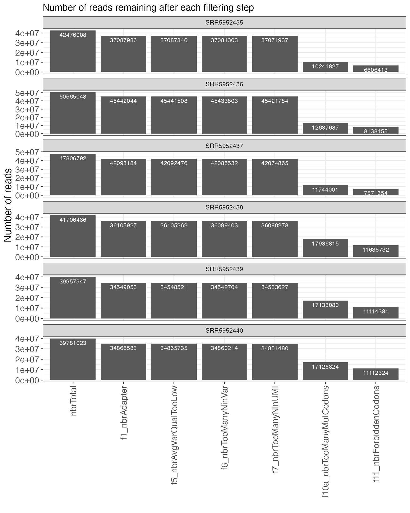
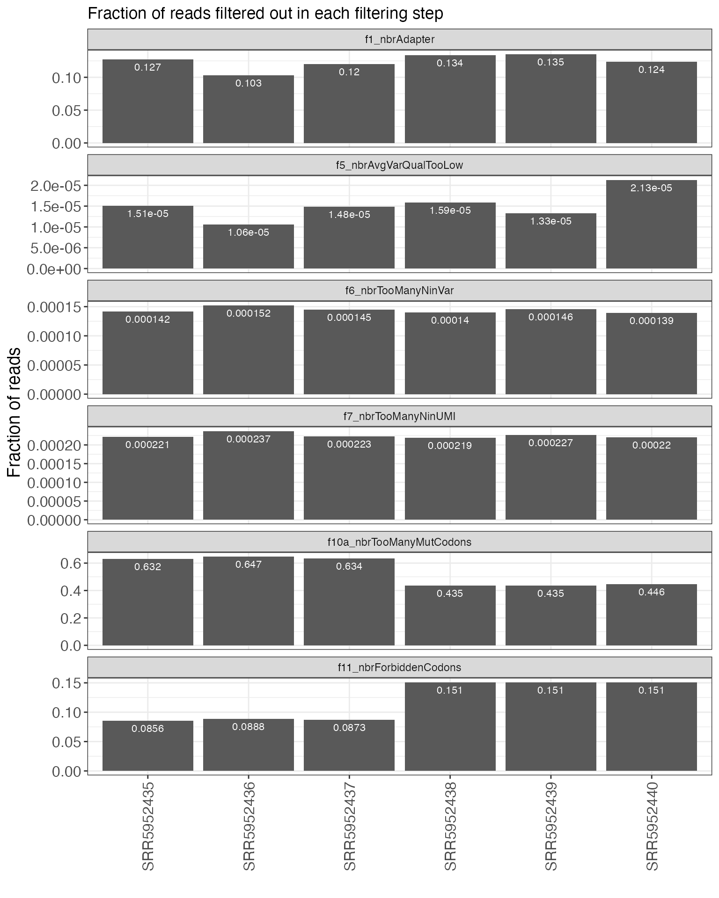
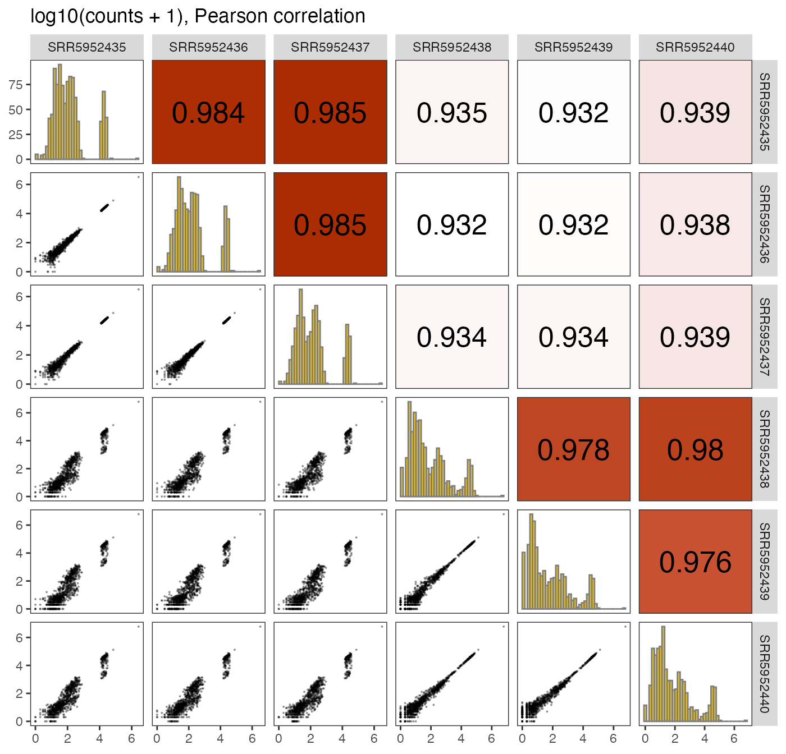
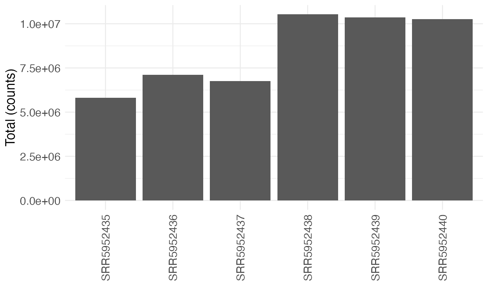
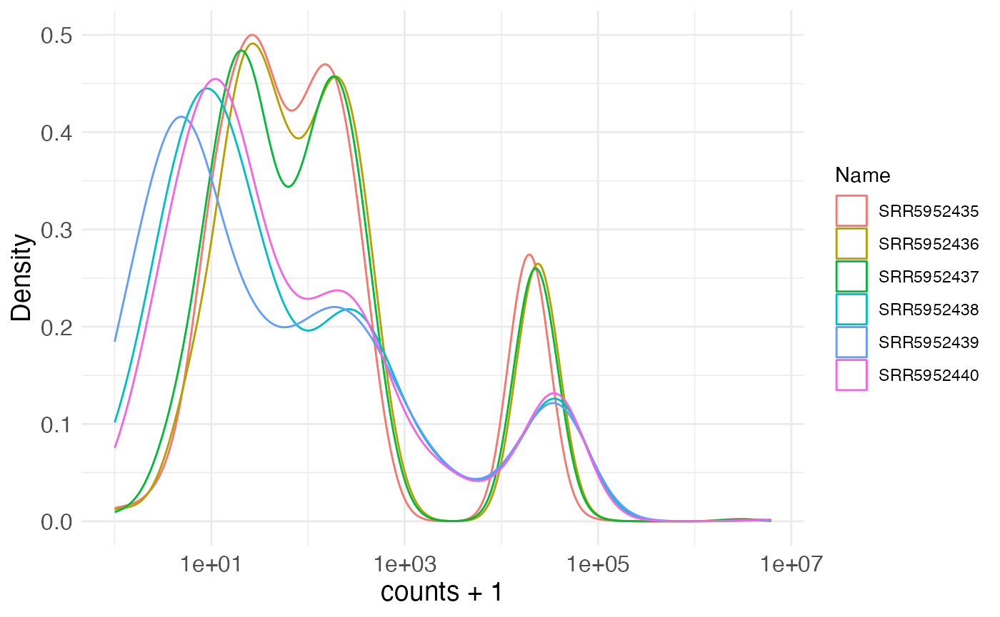
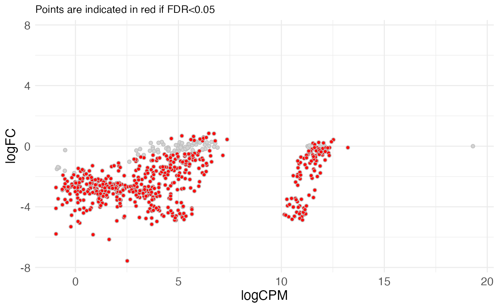
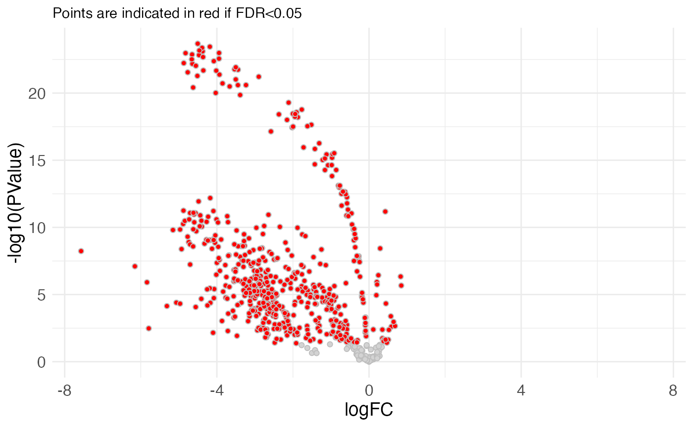

# Multiplexed assays of variant effect analysis with \`mutscan\`

``` r
library(SummarizedExperiment)
library(mutscan)
```

## Introduction

`mutscan` provides functionality for processing and visualizing
Multiplexed Assays of Variant Effect (MAVE) and other similar types of
data, starting from single-end or paired-end FASTQ files. A broad range
of library designs can be processed, encompassing experiments
considering either a single protein or combinations of multiple proteins
(e.g., aimed at studying protein-protein interactions).

The figure below provides a high-level overview of the `mutscan`
functionality, which will be described in more detail in the following
sections.

![Overview of the \`mutscan\` functionality. The \`digestFastqs()\`
function processes each sequencing library, possibly consisting of
multiple (pairs of) FASTQ files, separately, and generates an output
object containing, among other things, the count table and a summary of
the filtering steps. The \`summarizeExperiment()\` function takes one or
more of these objects and combines them into a \`SummarizedExperiment\`
object, that can then be used for downstream analysis such as plotting
and statistical testing.](mutscan-overview.001.png)

Overview of the `mutscan` functionality. The
[`digestFastqs()`](https://fmicompbio.github.io/mutscan/reference/digestFastqs.md)
function processes each sequencing library, possibly consisting of
multiple (pairs of) FASTQ files, separately, and generates an output
object containing, among other things, the count table and a summary of
the filtering steps. The
[`summarizeExperiment()`](https://fmicompbio.github.io/mutscan/reference/summarizeExperiment.md)
function takes one or more of these objects and combines them into a
`SummarizedExperiment` object, that can then be used for downstream
analysis such as plotting and statistical testing.

## Example data

The `mutscan` package contains several small example FASTQ files
representing different types of experiments:

``` r
datadir <- system.file("extdata", package = "mutscan")
dir(datadir)
#>  [1] "cisInput_1.fastq.gz"                 "cisInput_2.fastq.gz"                
#>  [3] "cisOutput_1.fastq.gz"                "cisOutput_2.fastq.gz"               
#>  [5] "GSE102901_cis_se.rds"                "leujunt0_1.fastq.gz"                
#>  [7] "leujunt0_2.fastq.gz"                 "multipleVariableRegions_R1.fastq.gz"
#>  [9] "multipleVariableRegions_R2.fastq.gz" "multipleVariableRegions_truth.rds"  
#> [11] "transInput_1.fastq.gz"               "transInput_2.fastq.gz"              
#> [13] "transOutput_1.fastq.gz"              "transOutput_2.fastq.gz"
```

- `transInput_{1,2}.fastq.gz`, `transOutput_{1,2}.fastq.gz` - data from
  TRANS experiment in \[@Diss2018\]. The forward and reverse reads
  correspond to the mutated *FOS* and *JUN* sequences, respectively.
  Each read consists of a UMI sequence, followed by a constant sequence
  and the variable region.
- `cisInput_{1,2}.fastq.gz`, `cisOutput_{1,2}.fastq.gz` - data from CIS
  experiment in \[@Diss2018\]. The forward and reverse reads both
  correspond to the mutated *FOS* sequence. Each read consists of a UMI
  sequence, followed by a constant sequence and the variable region.
- `GSE102901_cis_se.rds` - a `SummarizedExperiment` object obtained by
  processing the full CIS data from \[@Diss2018\].
- `leujunt0_{1,2}.fastq.gz` - unpublished data; the forward read
  corresponds to an unmutated sequence of one of 46 leucine zipper
  sequences, and the reverse read corresponds to mutated *JUN*
  sequences. Each read contains a (frame-shifted) primer sequence,
  followed by the variable region.

## Processing Multiplexed Assays of Variant Effect data

### Read composition specification

The main function for processing the Multiplexed Assays of Variant
Effect FASTQ files is
[`digestFastqs()`](https://fmicompbio.github.io/mutscan/reference/digestFastqs.md).
This function requires the specification of paths to compressed FASTQ
file(s) and the composition of the reads in these files. The composition
is specified by the user, and is given in the form of a character string
indicating the parts constituting the respective read, and an integer
vector specifying the lengths of the individual parts. The permitted
components are:

- `S` (skip) - nucleotide(s) to skip
- `U` (UMI) - UMI sequence
- `C` (constant) - constant sequence, can be used e.g. to estimate the
  sequencing error rate if available
- `V` (variable) - nucleotides corresponding to the variable region
- `P` (primer) - a primer sequence, which may appear in a nonspecified
  position in the read but whose position defines the start or end
  position of other components.

A read can have several components of the same type (e.g., skipped
nucleotides both in the beginning or the end, or two variable regions
separated by a primer). In such cases, `mutscan` will concatenate all
components of the same type in the processing, while recording the
lengths of the individual components.

As an example, a read with the following composition:

\[1 skipped nt\] - \[10 nt UMI\] - \[18 nt constant sequence\] - \[96 nt
variable region\]

would be specified to
[`digestFastqs()`](https://fmicompbio.github.io/mutscan/reference/digestFastqs.md)
by an elements string `"SUCV"`, and an element length vector
`c(1, 10, 18, 96)`.

The package can also accommodate designs with primer sequences. In this
situation, the primer acts as an ‘anchor’, and the read composition
before and after the primer is specified. For example, a read with the
following composition:

\[unknown sequence\] - \[10 nt primer\] - \[variable region,
constituting the remainder of the read\]

would be represented by an elements string `"SPV"`, and an element
length vector `c(-1, 10, -1)`, where the -1 indicates that the
corresponding read part consists of the remaining part of the read, not
accounted for by any of the other specified parts. In addition, the
sequence of the primer must be specified, and any read where the primer
is not present will be discarded.

The forward and reverse reads can have different compositions. The user
can also specify whether the variable parts of the forward and/or
reverse reads should be reverse complemented before being processed, and
whether the variable regions of the forward and reverse reads should be
merged into a single consensus sequence.

### Filtering

In addition to reading the FASTQ files, the
[`digestFastqs()`](https://fmicompbio.github.io/mutscan/reference/digestFastqs.md)
function will perform a series of filtering steps, in the following
order:

- Search for perfect matches to forward/reverse adapter sequences,
  filter out the read pair if a match is found in either the forward or
  reverse read.
- Search for perfect matches to forward/reverse primer sequences, filter
  out the read pair if not both are found.
- Filter out reads whose length is not compatible with the indicated
  composition.
- If forward and reverse variable regions should be merged, filter out
  read pairs where no valid overlap could be found.
- Filter out read pair if the average quality in the variable region is
  below `avePhredMin` in either the forward or reverse read (or the
  consensus sequence if they are merged).
- Filter out read pair if the number of Ns in the variable region
  exceeds `variableNMax`.
- Filter out read pair if the number of Ns in the combined forward and
  reverse UMI sequence exceeds `umiNMax`.
- If wild type (reference) sequences are provided (via `wildTypeForward`
  and/or `wildTypeReverse`), filter out reads if there are multiple best
  matches among the provided wild type sequences.
- Filter out read pair if any mutated base has a quality below
  `mutatedPhredMin`.
- Filter out read pair if the number of mutated codons exceeds
  `nbrMutatedCodonsMax` or the number of mutated nucleotides exceeds
  `nbrMutatedBasesMax`.
- Filter out read pair if any of the mutated codons match any of the
  codons encoded by `forbiddenMutatedCodons`.
- Filter out read pair if there are too many mutations in the constant
  sequence, or if there are multiple equally close best hits among the
  provided constant sequences.

Reads that are filtered out in one step will not be processed further
(and thus will not contribute to the count of reads being filtered out
for any other reasons).

## Processing TRANS data

Here, we illustrate the processing of the provided TRANS experiment
example data. We filter out reads with any adapter match, an average
phred quality below 20, any Ns in the UMI or variable sequence, more
than one mutated codon, or a mutated codon ending with A or T
(represented by the `NNW` value of the `forbiddenMutatedCodonsForward`
and `forbiddenMutatedCodonsReverse` arguments). In order to identify the
number of mutations, we have to provide the wild type sequences of *FOS*
and *JUN* (forward and reverse reads, respectively). This will
additionally name the final mutants according to the positions and
sequences of the mutated codons.

``` r
transInput <- digestFastqs(
    fastqForward = file.path(datadir, "transInput_1.fastq.gz"),
    fastqReverse = file.path(datadir, "transInput_2.fastq.gz"),
    mergeForwardReverse = FALSE, 
    revComplForward = FALSE, 
    revComplReverse = FALSE,
    adapterForward = "GGAAGAGCACACGTC", 
    adapterReverse = "GGAAGAGCGTCGTGT", 
    elementsForward = "SUCV",
    elementsReverse = "SUCV",
    elementLengthsForward = c(1, 10, 18, 96),
    elementLengthsReverse = c(1, 8, 20, 96),
    constantForward = "AACCGGAGGAGGGAGCTG",
    constantReverse = "GAAAAAGGAAGCTGGAGAGA", 
    avePhredMinForward = 20, 
    avePhredMinReverse = 20,
    variableNMaxForward = 0, 
    variableNMaxReverse = 0, 
    umiNMax = 0,
    wildTypeForward = c(FOS = "ACTGATACACTCCAAGCGGAGACAGACCAACTAGAAGATGAGAAGTCTGCTTTGCAGACCGAGATTGCCAACCTGCTGAAGGAGAAGGAAAAACTA"), 
    wildTypeReverse = c(JUN = "ATCGCCCGGCTGGAGGAAAAAGTGAAAACCTTGAAAGCTCAGAACTCGGAGCTGGCGTCCACGGCCAACATGCTCAGGGAACAGGTGGCACAGCTT"), 
    nbrMutatedCodonsMaxForward = 1, 
    nbrMutatedCodonsMaxReverse = 1,
    forbiddenMutatedCodonsForward = "NNW", 
    forbiddenMutatedCodonsReverse = "NNW",
    mutNameDelimiter = ".", 
    constantMaxDistForward = -1,
    constantMaxDistReverse = -1,
    verbose = FALSE
)
```

The
[`digestFastqs()`](https://fmicompbio.github.io/mutscan/reference/digestFastqs.md)
function returns a list with four elements. The `parameters` list
records all parameter values used during the processing, as well as the
`mutscan` version and time of processing.

``` r
transInput$parameters
#> $fastqForward
#> [1] "/Users/runner/work/_temp/Library/mutscan/extdata/transInput_1.fastq.gz"
#> 
#> $fastqReverse
#> [1] "/Users/runner/work/_temp/Library/mutscan/extdata/transInput_2.fastq.gz"
#> 
#> $mergeForwardReverse
#> [1] FALSE
#> 
#> $minOverlap
#> [1] 0
#> 
#> $maxOverlap
#> [1] 0
#> 
#> $minMergedLength
#> [1] 0
#> 
#> $maxMergedLength
#> [1] 0
#> 
#> $maxFracMismatchOverlap
#> [1] 1
#> 
#> $greedyOverlap
#> [1] TRUE
#> 
#> $revComplForward
#> [1] FALSE
#> 
#> $revComplReverse
#> [1] FALSE
#> 
#> $elementsForward
#> [1] "SUCV"
#> 
#> $elementLengthsForward
#> [1]  1 10 18 96
#> 
#> $elementsReverse
#> [1] "SUCV"
#> 
#> $elementLengthsReverse
#> [1]  1  8 20 96
#> 
#> $adapterForward
#> [1] "GGAAGAGCACACGTC"
#> 
#> $adapterReverse
#> [1] "GGAAGAGCGTCGTGT"
#> 
#> $primerForward
#> [1] ""
#> 
#> $primerReverse
#> [1] ""
#> 
#> $wildTypeForward
#>                                                                                                FOS 
#> "ACTGATACACTCCAAGCGGAGACAGACCAACTAGAAGATGAGAAGTCTGCTTTGCAGACCGAGATTGCCAACCTGCTGAAGGAGAAGGAAAAACTA" 
#> 
#> $wildTypeReverse
#>                                                                                                JUN 
#> "ATCGCCCGGCTGGAGGAAAAAGTGAAAACCTTGAAAGCTCAGAACTCGGAGCTGGCGTCCACGGCCAACATGCTCAGGGAACAGGTGGCACAGCTT" 
#> 
#> $constantForward
#> [1] "AACCGGAGGAGGGAGCTG"
#> 
#> $constantReverse
#> [1] "GAAAAAGGAAGCTGGAGAGA"
#> 
#> $avePhredMinForward
#> [1] 20
#> 
#> $avePhredMinReverse
#> [1] 20
#> 
#> $variableNMaxForward
#> [1] 0
#> 
#> $variableNMaxReverse
#> [1] 0
#> 
#> $umiNMax
#> [1] 0
#> 
#> $nbrMutatedCodonsMaxForward
#> [1] 1
#> 
#> $nbrMutatedCodonsMaxReverse
#> [1] 1
#> 
#> $nbrMutatedBasesMaxForward
#> [1] -1
#> 
#> $nbrMutatedBasesMaxReverse
#> [1] -1
#> 
#> $forbiddenMutatedCodonsForward
#>  [1] "AAA" "AAT" "ACA" "ACT" "AGA" "AGT" "ATA" "ATT" "CAA" "CAT" "CCA" "CCT"
#> [13] "CGA" "CGT" "CTA" "CTT" "GAA" "GAT" "GCA" "GCT" "GGA" "GGT" "GTA" "GTT"
#> [25] "TAA" "TAT" "TCA" "TCT" "TGA" "TGT" "TTA" "TTT"
#> 
#> $forbiddenMutatedCodonsReverse
#>  [1] "AAA" "AAT" "ACA" "ACT" "AGA" "AGT" "ATA" "ATT" "CAA" "CAT" "CCA" "CCT"
#> [13] "CGA" "CGT" "CTA" "CTT" "GAA" "GAT" "GCA" "GCT" "GGA" "GGT" "GTA" "GTT"
#> [25] "TAA" "TAT" "TCA" "TCT" "TGA" "TGT" "TTA" "TTT"
#> 
#> $useTreeWTmatch
#> [1] FALSE
#> 
#> $collapseToWTForward
#> [1] FALSE
#> 
#> $collapseToWTReverse
#> [1] FALSE
#> 
#> $mutatedPhredMinForward
#> [1] 0
#> 
#> $mutatedPhredMinReverse
#> [1] 0
#> 
#> $mutNameDelimiter
#> [1] "."
#> 
#> $constantMaxDistForward
#> [1] -1
#> 
#> $constantMaxDistReverse
#> [1] -1
#> 
#> $umiCollapseMaxDist
#> [1] 0
#> 
#> $filteredReadsFastqForward
#> [1] ""
#> 
#> $filteredReadsFastqReverse
#> [1] ""
#> 
#> $maxNReads
#> [1] -1
#> 
#> $nThreads
#> [1] 1
#> 
#> $chunkSize
#> [1] 100000
#> 
#> $maxReadLength
#> [1] 1024
#> 
#> $processingInfo
#> [1] "Processed by mutscan v1.3.0 on 2026-04-28 18:01:10.756292"
```

The `filterSummary` data.frame contains a summary of the number of reads
filtered out in each step. Note that for any given filtering step, only
the reads retained by the previous filters are considered. The numbers
in the filter column names indicate the order of the filters.

``` r
transInput$filterSummary
#>   nbrTotal f1_nbrAdapter f2_nbrNoPrimer f3_nbrReadWrongLength
#> 1     1000           314              0                     0
#>   f4_nbrNoValidOverlap f5_nbrAvgVarQualTooLow f6_nbrTooManyNinVar
#> 1                    0                      7                   0
#>   f7_nbrTooManyNinUMI f8_nbrTooManyBestWTHits f9_nbrMutQualTooLow
#> 1                   0                       0                   0
#>   f10a_nbrTooManyMutCodons f10b_nbrTooManyMutBases f11_nbrForbiddenCodons
#> 1                      392                       0                      8
#>   f12_nbrTooManyMutConstant f13_nbrTooManyBestConstantHits nbrRetained
#> 1                         0                              0         279
```

The `summaryTable` provides the number of reads and unique UMIs observed
for each variable sequence pair. The underscore in the strings in the
sequence column indicate the separation between the forward and reverse
wild type sequences. In addition, the table contains a column
`mutantName`, which provides a shorthand notation for each mutant. The
format of the values in this column is a combination of `WTS.xx.NNN`
(separated by `_`), where `WTS` provides the name of the closest
matching wild type sequence (if only one, unnamed wild type sequence is
provided, the name will be `f/r` depending on if it corresponds to the
forward/reverse read, respectively). The `xx` part indicates the mutated
codon or nucleotide number, and `NNN` gives the observed sequence for
the mutated codon or nucleotide. A sequence without mutations is named
`WTS.0.WT`, where, again, `WTS` is the name of the matching wild type
sequence.

``` r
head(transInput$summaryTable)
#>            mutantName
#> 1 FOS.0.WT_JUN.13.CCC
#> 2 FOS.0.WT_JUN.13.CTC
#> 3  FOS.0.WT_JUN.2.TCC
#> 4 FOS.0.WT_JUN.20.ACC
#> 5 FOS.0.WT_JUN.30.AGG
#> 6 FOS.0.WT_JUN.30.GGG
#>                                                                                                                                                                                            sequence
#> 1 ACTGATACACTCCAAGCGGAGACAGACCAACTAGAAGATGAGAAGTCTGCTTTGCAGACCGAGATTGCCAACCTGCTGAAGGAGAAGGAAAAACTA_ATCGCCCGGCTGGAGGAAAAAGTGAAAACCTTGAAACCCCAGAACTCGGAGCTGGCGTCCACGGCCAACATGCTCAGGGAACAGGTGGCACAGCTT
#> 2 ACTGATACACTCCAAGCGGAGACAGACCAACTAGAAGATGAGAAGTCTGCTTTGCAGACCGAGATTGCCAACCTGCTGAAGGAGAAGGAAAAACTA_ATCGCCCGGCTGGAGGAAAAAGTGAAAACCTTGAAACTCCAGAACTCGGAGCTGGCGTCCACGGCCAACATGCTCAGGGAACAGGTGGCACAGCTT
#> 3 ACTGATACACTCCAAGCGGAGACAGACCAACTAGAAGATGAGAAGTCTGCTTTGCAGACCGAGATTGCCAACCTGCTGAAGGAGAAGGAAAAACTA_ATCTCCCGGCTGGAGGAAAAAGTGAAAACCTTGAAAGCTCAGAACTCGGAGCTGGCGTCCACGGCCAACATGCTCAGGGAACAGGTGGCACAGCTT
#> 4 ACTGATACACTCCAAGCGGAGACAGACCAACTAGAAGATGAGAAGTCTGCTTTGCAGACCGAGATTGCCAACCTGCTGAAGGAGAAGGAAAAACTA_ATCGCCCGGCTGGAGGAAAAAGTGAAAACCTTGAAAGCTCAGAACTCGGAGCTGGCGACCACGGCCAACATGCTCAGGGAACAGGTGGCACAGCTT
#> 5 ACTGATACACTCCAAGCGGAGACAGACCAACTAGAAGATGAGAAGTCTGCTTTGCAGACCGAGATTGCCAACCTGCTGAAGGAGAAGGAAAAACTA_ATCGCCCGGCTGGAGGAAAAAGTGAAAACCTTGAAAGCTCAGAACTCGGAGCTGGCGTCCACGGCCAACATGCTCAGGGAACAGGTGAGGCAGCTT
#> 6 ACTGATACACTCCAAGCGGAGACAGACCAACTAGAAGATGAGAAGTCTGCTTTGCAGACCGAGATTGCCAACCTGCTGAAGGAGAAGGAAAAACTA_ATCGCCCGGCTGGAGGAAAAAGTGAAAACCTTGAAAGCTCAGAACTCGGAGCTGGCGTCCACGGCCAACATGCTCAGGGAACAGGTGGGGCAGCTT
#>   nbrReads maxNbrReads nbrUmis nbrMutBases nbrMutCodons nbrMutAAs varLengths
#> 1        1           1       1           2            1         1      96_96
#> 2        1           1       1           3            1         1      96_96
#> 3        1           1       1           1            1         1      96_96
#> 4        1           1       1           1            1         1      96_96
#> 5        1           1       1           3            1         1      96_96
#> 6        1           1       1           2            1         1      96_96
#>                        mutantNameBase     mutantNameCodon
#> 1          FOS.0.WT_JUN.37.C_JUN.39.C FOS.0.WT_JUN.13.CCC
#> 2 FOS.0.WT_JUN.37.C_JUN.38.T_JUN.39.C FOS.0.WT_JUN.13.CTC
#> 3                    FOS.0.WT_JUN.4.T  FOS.0.WT_JUN.2.TCC
#> 4                   FOS.0.WT_JUN.58.A FOS.0.WT_JUN.20.ACC
#> 5 FOS.0.WT_JUN.88.A_JUN.89.G_JUN.90.G FOS.0.WT_JUN.30.AGG
#> 6          FOS.0.WT_JUN.89.G_JUN.90.G FOS.0.WT_JUN.30.GGG
#>           mutantNameBaseHGVS      mutantNameAA       mutantNameAAHGVS
#> 1 FOS:c_JUN:c.37_39delinsCCC FOS.0.WT_JUN.13.P FOS:p_JUN:p.(Ala13Pro)
#> 2 FOS:c_JUN:c.37_39delinsCTC FOS.0.WT_JUN.13.L FOS:p_JUN:p.(Ala13Leu)
#> 3           FOS:c_JUN:c.4G>T  FOS.0.WT_JUN.2.S  FOS:p_JUN:p.(Ala2Ser)
#> 4          FOS:c_JUN:c.58T>A FOS.0.WT_JUN.20.T FOS:p_JUN:p.(Ser20Thr)
#> 5 FOS:c_JUN:c.88_90delinsAGG FOS.0.WT_JUN.30.R FOS:p_JUN:p.(Ala30Arg)
#> 6  FOS:c_JUN:c.89_90delinsGG FOS.0.WT_JUN.30.G FOS:p_JUN:p.(Ala30Gly)
#>   mutationTypes
#> 1 nonsynonymous
#> 2 nonsynonymous
#> 3 nonsynonymous
#> 4 nonsynonymous
#> 5 nonsynonymous
#> 6 nonsynonymous
#>                                                          sequenceAA
#> 1 TDTLQAETDQLEDEKSALQTEIANLLKEKEKL_IARLEEKVKTLKPQNSELASTANMLREQVAQL
#> 2 TDTLQAETDQLEDEKSALQTEIANLLKEKEKL_IARLEEKVKTLKLQNSELASTANMLREQVAQL
#> 3 TDTLQAETDQLEDEKSALQTEIANLLKEKEKL_ISRLEEKVKTLKAQNSELASTANMLREQVAQL
#> 4 TDTLQAETDQLEDEKSALQTEIANLLKEKEKL_IARLEEKVKTLKAQNSELATTANMLREQVAQL
#> 5 TDTLQAETDQLEDEKSALQTEIANLLKEKEKL_IARLEEKVKTLKAQNSELASTANMLREQVRQL
#> 6 TDTLQAETDQLEDEKSALQTEIANLLKEKEKL_IARLEEKVKTLKAQNSELASTANMLREQVGQL
```

Finally, the `errorStatistics` data.frame lists the number of matching
and mismatching bases in the constant sequences, stratified by the phred
quality score (from 0 to 99).

``` r
transInput$errorStatistics[rowSums(transInput$errorStatistics[, -1]) != 0, ]
#>    PhredQuality nbrMatchForward nbrMismatchForward nbrMatchReverse
#> 15           14             160                 11             204
#> 23           22              52                  0              14
#> 28           27             302                  4             474
#> 34           33             472                  0             462
#> 38           37            4020                  1            4405
#>    nbrMismatchReverse
#> 15                 17
#> 23                  0
#> 28                  3
#> 34                  1
#> 38                  0
```

The `errorStatistics` output can be used to estimate the sequencing
error rate:

``` r
(propErrorsConstantF <- sum(transInput$errorStatistics$nbrMismatchForward) /
   (nchar(transInput$parameters$constantForward) * 
        transInput$filterSummary$nbrRetained))
#> [1] 0.003185982
(propErrorsConstantR <- sum(transInput$errorStatistics$nbrMismatchReverse) /
   (nchar(transInput$parameters$constantReverse) * 
        transInput$filterSummary$nbrRetained))
#> [1] 0.003763441
```

## Processing CIS data

Next, we illustrate the processing of the provided CIS experiment
example data. Recall that in this case, both the forward and reverse
variable sequence correspond to the same mutated *FOS* sequence, and
before matching to the wild type sequence, the two components need to be
merged to generate a single variable sequence (this is specified via the
`mergeForwardReverse` argument). As for the TRANS data, we filter out
reads with any adapter match, an average phred quality below 20, any Ns
in the UMI or variable sequence, more than one mutated codon, or a
mutated codon ending with A or T (represented by the `NNW` value of the
`forbiddenMutatedCodonsForward` argument). Since the forward and reverse
variable sequences are merged into one variable sequence, only one wild
type sequence is provided (the `wildTypeReverse` argument will be
ignored if specified).

``` r
cisInput <- digestFastqs(
    fastqForward = file.path(datadir, "cisInput_1.fastq.gz"),
    fastqReverse = file.path(datadir, "cisInput_2.fastq.gz"),
    mergeForwardReverse = TRUE, 
    minOverlap = 0, 
    maxOverlap = 0, 
    maxFracMismatchOverlap = 1, 
    greedyOverlap = TRUE, 
    revComplForward = FALSE, 
    revComplReverse = TRUE,
    adapterForward = "GGAAGAGCACACGTC", 
    adapterReverse = "GGAAGAGCGTCGTGT", 
    elementsForward = "SUCV", 
    elementsReverse = "SUCVS",
    elementLengthsForward = c(1, 10, 18, 96),
    elementLengthsReverse = c(1, 7, 17, 96, -1),
    constantForward = "AACCGGAGGAGGGAGCTG",
    constantReverse = "GAGTTCATCCTGGCAGC", 
    primerForward = "", 
    primerReverse = "",
    avePhredMinForward = 20, 
    avePhredMinReverse = 20,
    variableNMaxForward = 0, 
    variableNMaxReverse = 0, 
    umiNMax = 0,
    wildTypeForward = c(FOS = "ACTGATACACTCCAAGCGGAGACAGACCAACTAGAAGATGAGAAGTCTGCTTTGCAGACCGAGATTGCCAACCTGCTGAAGGAGAAGGAAAAACTA"), 
    wildTypeReverse = "", 
    nbrMutatedCodonsMaxForward = 1, 
    nbrMutatedCodonsMaxReverse = 1, 
    forbiddenMutatedCodonsForward = "NNW", 
    forbiddenMutatedCodonsReverse = "NNW",
    mutNameDelimiter = ".", 
    constantMaxDistForward = -1,
    constantMaxDistReverse = -1,
    verbose = TRUE
)
#> done enumerating forbidden codons (32)
#> done enumerating forbidden codons (32)
#> start reading sequences for file pair 1 of 1...
#>     1000 read pairs processed (16.7% retained)
#> done reading sequences
#> retained 67 unique features
```

``` r
cisInput$parameters
#> $fastqForward
#> [1] "/Users/runner/work/_temp/Library/mutscan/extdata/cisInput_1.fastq.gz"
#> 
#> $fastqReverse
#> [1] "/Users/runner/work/_temp/Library/mutscan/extdata/cisInput_2.fastq.gz"
#> 
#> $mergeForwardReverse
#> [1] TRUE
#> 
#> $minOverlap
#> [1] 0
#> 
#> $maxOverlap
#> [1] 0
#> 
#> $minMergedLength
#> [1] 0
#> 
#> $maxMergedLength
#> [1] 0
#> 
#> $maxFracMismatchOverlap
#> [1] 1
#> 
#> $greedyOverlap
#> [1] TRUE
#> 
#> $revComplForward
#> [1] FALSE
#> 
#> $revComplReverse
#> [1] TRUE
#> 
#> $elementsForward
#> [1] "SUCV"
#> 
#> $elementLengthsForward
#> [1]  1 10 18 96
#> 
#> $elementsReverse
#> [1] "SUCVS"
#> 
#> $elementLengthsReverse
#> [1]  1  7 17 96 -1
#> 
#> $adapterForward
#> [1] "GGAAGAGCACACGTC"
#> 
#> $adapterReverse
#> [1] "GGAAGAGCGTCGTGT"
#> 
#> $primerForward
#> [1] ""
#> 
#> $primerReverse
#> [1] ""
#> 
#> $wildTypeForward
#>                                                                                                FOS 
#> "ACTGATACACTCCAAGCGGAGACAGACCAACTAGAAGATGAGAAGTCTGCTTTGCAGACCGAGATTGCCAACCTGCTGAAGGAGAAGGAAAAACTA" 
#> 
#> $wildTypeReverse
#>  r 
#> "" 
#> 
#> $constantForward
#> [1] "AACCGGAGGAGGGAGCTG"
#> 
#> $constantReverse
#> [1] "GAGTTCATCCTGGCAGC"
#> 
#> $avePhredMinForward
#> [1] 20
#> 
#> $avePhredMinReverse
#> [1] 20
#> 
#> $variableNMaxForward
#> [1] 0
#> 
#> $variableNMaxReverse
#> [1] 0
#> 
#> $umiNMax
#> [1] 0
#> 
#> $nbrMutatedCodonsMaxForward
#> [1] 1
#> 
#> $nbrMutatedCodonsMaxReverse
#> [1] 1
#> 
#> $nbrMutatedBasesMaxForward
#> [1] -1
#> 
#> $nbrMutatedBasesMaxReverse
#> [1] -1
#> 
#> $forbiddenMutatedCodonsForward
#>  [1] "AAA" "AAT" "ACA" "ACT" "AGA" "AGT" "ATA" "ATT" "CAA" "CAT" "CCA" "CCT"
#> [13] "CGA" "CGT" "CTA" "CTT" "GAA" "GAT" "GCA" "GCT" "GGA" "GGT" "GTA" "GTT"
#> [25] "TAA" "TAT" "TCA" "TCT" "TGA" "TGT" "TTA" "TTT"
#> 
#> $forbiddenMutatedCodonsReverse
#>  [1] "AAA" "AAT" "ACA" "ACT" "AGA" "AGT" "ATA" "ATT" "CAA" "CAT" "CCA" "CCT"
#> [13] "CGA" "CGT" "CTA" "CTT" "GAA" "GAT" "GCA" "GCT" "GGA" "GGT" "GTA" "GTT"
#> [25] "TAA" "TAT" "TCA" "TCT" "TGA" "TGT" "TTA" "TTT"
#> 
#> $useTreeWTmatch
#> [1] FALSE
#> 
#> $collapseToWTForward
#> [1] FALSE
#> 
#> $collapseToWTReverse
#> [1] FALSE
#> 
#> $mutatedPhredMinForward
#> [1] 0
#> 
#> $mutatedPhredMinReverse
#> [1] 0
#> 
#> $mutNameDelimiter
#> [1] "."
#> 
#> $constantMaxDistForward
#> [1] -1
#> 
#> $constantMaxDistReverse
#> [1] -1
#> 
#> $umiCollapseMaxDist
#> [1] 0
#> 
#> $filteredReadsFastqForward
#> [1] ""
#> 
#> $filteredReadsFastqReverse
#> [1] ""
#> 
#> $maxNReads
#> [1] -1
#> 
#> $nThreads
#> [1] 1
#> 
#> $chunkSize
#> [1] 100000
#> 
#> $maxReadLength
#> [1] 1024
#> 
#> $processingInfo
#> [1] "Processed by mutscan v1.3.0 on 2026-04-28 18:01:11.165366"
cisInput$filterSummary
#>   nbrTotal f1_nbrAdapter f2_nbrNoPrimer f3_nbrReadWrongLength
#> 1     1000           126              0                     0
#>   f4_nbrNoValidOverlap f5_nbrAvgVarQualTooLow f6_nbrTooManyNinVar
#> 1                    0                      0                  44
#>   f7_nbrTooManyNinUMI f8_nbrTooManyBestWTHits f9_nbrMutQualTooLow
#> 1                   0                       0                   0
#>   f10a_nbrTooManyMutCodons f10b_nbrTooManyMutBases f11_nbrForbiddenCodons
#> 1                      581                       0                     82
#>   f12_nbrTooManyMutConstant f13_nbrTooManyBestConstantHits nbrRetained
#> 1                         0                              0         167
cisInput$errorStatistics[rowSums(cisInput$errorStatistics[, -1]) != 0, ]
#>    PhredQuality nbrMatchForward nbrMismatchForward nbrMatchReverse
#> 3             2               0                  0               0
#> 15           14              51                  1              41
#> 23           22              19                  0               0
#> 28           27              79                  1              56
#> 34           33             163                  0              96
#> 38           37            2690                  2            2620
#>    nbrMismatchReverse
#> 3                   4
#> 15                  7
#> 23                  0
#> 28                  0
#> 34                  1
#> 38                 14
```

The `summaryTable` now provides the number of reads and unique UMIs
observed for each variable sequence, and all values in the `mutNames`
column will start with `FOS`.

``` r
head(cisInput$summaryTable)
#>   mutantName
#> 1   FOS.0.WT
#> 2  FOS.1.ACC
#> 3  FOS.1.ACG
#> 4 FOS.11.CTG
#> 5 FOS.13.GAC
#> 6 FOS.13.GAG
#>                                                                                           sequence
#> 1 ACTGATACACTCCAAGCGGAGACAGACCAACTAGAAGATGAGAAGTCTGCTTTGCAGACCGAGATTGCCAACCTGCTGAAGGAGAAGGAAAAACTA
#> 2 ACCGATACACTCCAAGCGGAGACAGACCAACTAGAAGATGAGAAGTCTGCTTTGCAGACCGAGATTGCCAACCTGCTGAAGGAGAAGGAAAAACTA
#> 3 ACGGATACACTCCAAGCGGAGACAGACCAACTAGAAGATGAGAAGTCTGCTTTGCAGACCGAGATTGCCAACCTGCTGAAGGAGAAGGAAAAACTA
#> 4 ACTGATACACTCCAAGCGGAGACAGACCAACTGGAAGATGAGAAGTCTGCTTTGCAGACCGAGATTGCCAACCTGCTGAAGGAGAAGGAAAAACTA
#> 5 ACTGATACACTCCAAGCGGAGACAGACCAACTAGAAGACGAGAAGTCTGCTTTGCAGACCGAGATTGCCAACCTGCTGAAGGAGAAGGAAAAACTA
#> 6 ACTGATACACTCCAAGCGGAGACAGACCAACTAGAAGAGGAGAAGTCTGCTTTGCAGACCGAGATTGCCAACCTGCTGAAGGAGAAGGAAAAACTA
#>   nbrReads maxNbrReads nbrUmis nbrMutBases nbrMutCodons nbrMutAAs varLengths
#> 1       77          77      77           0            0         0         96
#> 2        2           2       2           1            1         0         96
#> 3        1           1       1           1            1         0         96
#> 4        1           1       1           1            1         0         96
#> 5        1           1       1           1            1         0         96
#> 6        1           1       1           1            1         1         96
#>   mutantNameBase mutantNameCodon mutantNameBaseHGVS mutantNameAA
#> 1       FOS.0.WT        FOS.0.WT              FOS:c     FOS.0.WT
#> 2        FOS.3.C       FOS.1.ACC         FOS:c.3T>C     FOS.0.WT
#> 3        FOS.3.G       FOS.1.ACG         FOS:c.3T>G     FOS.0.WT
#> 4       FOS.33.G      FOS.11.CTG        FOS:c.33A>G     FOS.0.WT
#> 5       FOS.39.C      FOS.13.GAC        FOS:c.39T>C     FOS.0.WT
#> 6       FOS.39.G      FOS.13.GAG        FOS:c.39T>G     FOS.13.E
#>   mutantNameAAHGVS mutationTypes                       sequenceAA
#> 1            FOS:p               TDTLQAETDQLEDEKSALQTEIANLLKEKEKL
#> 2            FOS:p        silent TDTLQAETDQLEDEKSALQTEIANLLKEKEKL
#> 3            FOS:p        silent TDTLQAETDQLEDEKSALQTEIANLLKEKEKL
#> 4            FOS:p        silent TDTLQAETDQLEDEKSALQTEIANLLKEKEKL
#> 5            FOS:p        silent TDTLQAETDQLEDEKSALQTEIANLLKEKEKL
#> 6 FOS:p.(Asp13Glu) nonsynonymous TDTLQAETDQLEEEKSALQTEIANLLKEKEKL
```

## Processing TRANS data with primers

Finally, we illustrate the processing of the provided example data,
where the first read corresponds to one of 46 leucine zipper sequences,
and the second read is a mutated *JUN* sequence. We first need to define
the possible sequences for the forward read. If multiple wild type
sequences are provided like here, `mutscan` will match each read against
all of them and find the most similar one for each read.

``` r
leu <- c(
    ATF2 = "GATCCTGATGAAAAAAGGAGAAAGTTTTTAGAGCGAAATAGAGCAGCAGCTTCAAGATGCCGACAAAAAAGGAAAGTCTGGGTTCAGTCTTTAGAGAAGAAAGCTGAAGACTTGAGTTCATTAAATGGTCAGCTGCAGAGTGAAGTCACCCTGCTGAGAAATGAAGTGGCACAGCTGAAACAGCTTCTTCTGGCT",
    ATF7 = "GATCCAGATGAGCGACGGCAGCGCTTTCTGGAGCGCAACCGGGCTGCAGCCTCCCGCTGCCGCCAAAAGCGAAAGCTGTGGGTGTCCTCCCTAGAGAAGAAGGCCGAAGAACTCACTTCTCAGAACATTCAGCTGAGTAATGAAGTCACATTACTACGCAATGAGGTGGCCCAGTTGAAACAGCTACTGTTAGCT",
    CREB5 = "GATCCGGACGAGAGGCGGCGGAAATTTCTGGAACGGAACCGGGCAGCTGCCACCCGCTGCAGACAGAAGAGGAAGGTCTGGGTGATGTCATTGGAAAAGAAAGCAGAAGAACTCACCCAGACAAACATGCAGCTTCAGAATGAAGTGTCTATGTTGAAAAATGAGGTGGCCCAGCTGAAACAGTTGTTGTTAACA",
    ATF3 = "GAAGAAGATGAAAGGAAAAAGAGGCGACGAGAAAGAAATAAGATTGCAGCTGCAAAGTGCCGAAACAAGAAGAAGGAGAAGACGGAGTGCCTGCAGAAAGAGTCGGAGAAGCTGGAAAGTGTGAATGCTGAACTGAAGGCTCAGATTGAGGAGCTCAAGAACGAGAAGCAGCATTTGATATACATGCTCAACCTT",
    JDP2 = "GAGGAAGAGGAGCGAAGGAAAAGGCGCCGGGAGAAGAACAAAGTCGCAGCAGCCCGATGCCGGAACAAGAAGAAGGAGCGCACGGAGTTTCTGCAGCGGGAATCCGAGCGGCTGGAACTCATGAACGCAGAGCTGAAGACCCAGATTGAGGAGCTGAAGCAGGAGCGGCAGCAGCTCATCCTGATGCTGAACCGA",
    ATF4 = "GAGAAACTGGATAAGAAGCTGAAAAAAATGGAGCAAAACAAGACAGCAGCCACTAGGTACCGCCAGAAGAAGAGGGCGGAGCAGGAGGCTCTTACTGGTGAGTGCAAAGAGCTGGAAAAGAAGAACGAGGCTCTAAAAGAGAGGGCGGATTCCCTGGCCAAGGAGATCCAGTACCTGAAAGATTTGATAGAAGAG",
    ATF5 = "ACCCGAGGGGACCGCAAGCAAAAGAAGAGAGACCAGAACAAGTCGGCGGCTCTGAGGTACCGCCAGCGGAAGCGGGCAGAGGGTGAGGCCCTGGAGGGCGAGTGCCAGGGGCTGGAGGCACGGAATCGCGAGCTGAAGGAACGGGCAGAGTCCGTGGAGCGCGAGATCCAGTACGTCAAGGACCTGCTCATCGAG",
    CREBZF = "AGTCCCCGGAAGGCGGCGGCGGCCGCTGCCCGCCTTAATCGACTGAAGAAGAAGGAGTACGTGATGGGGCTGGAGAGTCGAGTCCGGGGTCTGGCAGCCGAGAACCAGGAGCTGCGGGCCGAGAATCGGGAGCTGGGCAAACGCGTACAGGCACTGCAGGAGGAGAGTCGCTACCTACGGGCAGTCTTAGCCAAC",
    BATF2 = "CCCAAGGAGCAACAAAGGCAGCTGAAGAAGCAGAAGAACCGGGCAGCCGCCCAGCGAAGCCGGCAGAAGCACACAGACAAGGCAGACGCCCTGCACCAGCAGCACGAGTCTCTGGAAAAAGACAACCTCGCCCTGCGGAAGGAGATCCAGTCCCTGCAGGCCGAGCTGGCGTGGTGGAGCCGGACCCTGCACGTG",
    BATF3 = "GAGGATGATGACAGGAAGGTCCGAAGGAGAGAAAAAAACCGAGTTGCTGCTCAGAGAAGTCGGAAGAAGCAGACCCAGAAGGCTGACAAGCTCCATGAGGAATATGAGAGCCTGGAGCAAGAAAACACCATGCTGCGGAGAGAGATCGGGAAGCTGACAGAGGAGCTGAAGCACCTGACAGAGGCACTGAAGGAG",
    CEBPE = "AAAGATAGCCTTGAGTACCGGCTGAGGCGGGAGCGCAACAACATCGCCGTGCGCAAGAGCCGAGACAAGGCCAAGAGGCGCATTCTGGAGACGCAGCAGAAGGTGCTGGAGTACATGGCAGAGAACGAGCGCCTCCGCAGCCGCGTGGAGCAGCTCACCCAGGAGCTAGACACCCTCCGCAACCTCTTCCGCCAG",
    BACH1 = "CTGGATTGTATCCATGATATTCGAAGAAGAAGTAAAAACAGAATTGCTGCACAGCGCTGTCGCAAGAGAAAACTTGACTGTATACAGAATCTTGAATCAGAAATTGAGAAGCTGCAAAGTGAAAAGGAGAGCTTGTTGAAGGAAAGAGATCACATTTTGTCAACTCTGGGTGAGACAAAGCAGAACCTAACTGGA",
    BACH2 = "TTAGAGTTTATTCATGATGTCCGACGGCGCAGCAAGAACCGCATCGCGGCCCAGCGCTGCCGCAAAAGGAAACTGGACTGTATTCAGAATTTAGAATGTGAAATCCGCAAATTGGTGTGTGAGAAAGAGAAACTGTTGTCAGAGAGGAATCAACTGAAAGCATGCATGGGGGAACTGTTGGACAACTTCTCCTGC",
    NFE2L1 = "CTGAGCCTCATCCGAGACATCCGGCGCCGGGGCAAGAACAAGATGGCGGCGCAGAACTGCCGCAAGCGCAAGCTGGACACCATCCTGAATCTGGAGCGTGATGTGGAGGACCTGCAGCGTGACAAAGCCCGGCTGCTGCGGGAGAAAGTGGAGTTCCTGCGCTCCCTGCGACAGATGAAGCAGAAGGTCCAGAGC",
    NFE2 = "CTAGCGCTAGTCCGGGACATCCGACGACGGGGCAAAAACAAGGTGGCAGCCCAGAACTGCCGCAAGAGGAAGCTGGAAACCATTGTGCAGCTGGAGCGGGAGCTGGAGCGGCTGACCAATGAACGGGAGCGGCTTCTCAGGGCCCGCGGGGAGGCAGACCGGACCCTGGAGGTCATGCGCCAACAGCTGACAGAG",
    NFIL3 = "AAGAAAGATGCTATGTATTGGGAAAAAAGGCGGAAAAATAATGAAGCTGCCAAAAGATCTCGTGAGAAGCGTCGACTGAATGACCTGGTTTTAGAGAACAAACTAATTGCACTGGGAGAAGAAAACGCCACTTTAAAAGCTGAGCTGCTTTCACTAAAATTAAAGTTTGGTTTAATTAGCTCCACAGCATATGCT",
    FOS = "GAAGAAGAAGAGAAAAGGAGAATCCGAAGGGAAAGGAATAAGATGGCTGCAGCCAAATGCCGCAACCGGAGGAGGGAGCTGACTGATACACTCCAAGCGGAGACAGACCAACTAGAAGATGAGAAGTCTGCTTTGCAGACCGAGATTGCCAACCTGCTGAAGGAGAAGGAAAAACTAGAGTTCATCCTGGCAGCT",
    FOSB = "GAGGAAGAGGAGAAGCGAAGGGTGCGCCGGGAACGAAATAAACTAGCAGCAGCTAAATGCAGGAACCGGCGGAGGGAGCTGACCGACCGACTCCAGGCGGAGACAGATCAGTTGGAGGAAGAAAAAGCAGAGCTGGAGTCGGAGATCGCCGAGCTCCAAAAGGAGAAGGAACGTCTGGAGTTTGTGCTGGTGGCC",
    FOSL1 = "GAGGAAGAGGAGCGCCGCCGAGTAAGGCGCGAGCGGAACAAGCTGGCTGCGGCCAAGTGCAGGAACCGGAGGAAGGAACTGACCGACTTCCTGCAGGCGGAGACTGACAAACTGGAAGATGAGAAATCTGGGCTGCAGCGAGAGATTGAGGAGCTGCAGAAGCAGAAGGAGCGCCTAGAGCTGGTGCTGGAAGCC",
    FOSL2 = "GAAGAGGAGGAGAAGCGTCGCATCCGGCGGGAGAGGAACAAGCTGGCTGCAGCCAAGTGCCGGAACCGACGCCGGGAGCTGACAGAGAAGCTGCAGGCGGAGACAGAGGAGCTGGAGGAGGAGAAGTCAGGCCTGCAGAAGGAGATTGCTGAGCTGCAGAAGGAGAAGGAGAAGCTGGAGTTCATGTTGGTGGCT",
    MAFB = "GTGATCCGCCTGAAGCAGAAGCGGCGGACCCTGAAGAACCGGGGCTACGCCCAGTCTTGCAGGTATAAACGCGTCCAGCAGAAGCACCACCTGGAGAATGAGAAGACGCAGCTCATTCAGCAGGTGGAGCAGCTTAAGCAGGAGGTGTCCCGGCTGGCCCGCGAGAGAGACGCCTACAAGGTCAAGTGCGAGAAA",
    JUN = "CAGGAGCGGATCAAGGCGGAGAGGAAGCGCATGAGGAACCGCATCGCTGCCTCCAAGTGCCGAAAAAGGAAGCTGGAGAGAATCGCCCGGCTGGAGGAAAAAGTGAAAACCTTGAAAGCTCAGAACTCGGAGCTGGCGTCCACGGCCAACATGCTCAGGGAACAGGTGGCACAGCTTAAACAGAAAGTCATGAAC",
    JUNB = "CAAGAGCGCATCAAAGTGGAGCGCAAGCGGCTGCGGAACCGGCTGGCGGCCACCAAGTGCCGGAAGCGGAAGCTGGAGCGCATCGCGCGCCTGGAGGACAAGGTGAAGACGCTCAAGGCCGAGAACGCGGGGCTGTCGAGTACCGCCGGCCTCCTCCGGGAGCAGGTGGCCCAGCTCAAACAGAAGGTCATGACC",
    JUND = "CAGGAGCGCATCAAGGCGGAGCGCAAGCGGCTGCGCAACCGCATCGCCGCCTCCAAGTGCCGCAAGCGCAAGCTGGAGCGCATCTCGCGCCTGGAAGAGAAAGTGAAGACCCTCAAGAGTCAGAACACGGAGCTGGCGTCCACGGCGAGCCTGCTGCGCGAGCAGGTGGCGCAGCTCAAGCAGAAAGTCCTCAGC",
    CREB3 = "GAACAAATTCTGAAACGTGTGCGGAGGAAGATTCGAAATAAAAGATCTGCTCAAGAGAGCCGCAGGAAAAAGAAGGTGTATGTTGGGGGTTTAGAGAGCAGGGTCTTGAAATACACAGCCCAGAATATGGAGCTTCAGAACAAAGTACAGCTTCTGGAGGAACAGAATTTGTCCCTTCTAGATCAACTGAGGAAA",
    HLF = "CTGAAGGATGACAAGTACTGGGCAAGGCGCAGAAAGAACAACATGGCAGCCAAGCGCTCCCGCGACGCCCGGAGGCTGAAAGAGAACCAGATCGCCATCCGGGCCTCGTTCCTGGAGAAGGAGAACTCGGCCCTCCGCCAGGAGGTGGCTGACTTGAGGAAGGAGCTGGGCAAATGCAAGAACATACTTGCCAAG",
    MAFG = "ATCGTCCAGCTGAAGCAGCGCCGGCGCACGCTCAAGAACCGCGGCTACGCTGCCAGCTGCCGCGTGAAGCGGGTGACGCAGAAGGAGGAGCTGGAGAAGCAGAAGGCGGAGCTGCAGCAGGAGGTGGAGAAGCTGGCCTCAGAGAACGCCAGCATGAAGCTGGAGCTCGACGCGCTGCGCTCCAAGTACGAGGCG",
    MAFK = "GTGACCCGCCTGAAGCAGCGTCGGCGCACACTCAAGAACCGCGGCTACGCGGCCAGCTGCCGCATCAAGCGGGTGACGCAGAAGGAGGAGCTGGAGCGGCAGCGCGTGGAGCTGCAGCAGGAGGTGGAGAAGCTGGCGCGTGAGAACAGCAGCATGCGGCTGGAGCTGGACGCCCTGCGCTCCAAGTACGAGGCG",
    XBP1 = "AGCCCCGAGGAGAAGGCGCTGAGGAGGAAACTGAAAAACAGAGTAGCAGCTCAGACTGCCAGAGATCGAAAGAAGGCTCGAATGAGTGAGCTGGAACAGCAAGTGGTAGATTTAGAAGAAGAGAACCAAAAACTTTTGCTAGAAAATCAGCTTTTACGAGAGAAAACTCATGGCCTTGTAGTTGAGAACCAGGAG",
    ATF6 = "ATTGCTGTGCTAAGGAGACAGCAACGTATGATAAAAAATCGAGAATCCGCTTGTCAGTCTCGCAAGAAGAAGAAAGAATATATGCTAGGGTTAGAGGCGAGATTAAAGGCTGCCCTCTCAGAAAACGAGCAACTGAAGAAAGAAAATGGAACACTGAAGCGGCAGCTGGATGAAGTTGTGTCAGAGAACCAGAGG",
    ATF6B = "GCAAAGCTGCTGAAGCGGCAGCAGCGAATGATCAAGAACCGGGAGTCAGCCTGCCAGTCCCGGAGAAAGAAGAAAGAGTATCTGCAGGGACTGGAGGCTCGGCTGCAAGCAGTACTGGCTGACAACCAGCAGCTCCGCCGAGAGAATGCTGCCCTCCGGCGGCGGCTGGAGGCCCTGCTGGCTGAAAACAGCGAG",
    CEBPA = "AAGAACAGCAACGAGTACCGGGTGCGGCGCGAGCGCAACAACATCGCGGTGCGCAAGAGCCGCGACAAGGCCAAGCAGCGCAACGTGGAGACGCAGCAGAAGGTGCTGGAGCTGACCAGTGACAATGACCGCCTGCGCAAGCGGGTGGAACAGCTGAGCCGCGAACTGGACACGCTGCGGGGCATCTTCCGCCAG",
    CEBPB = "AAGCACAGCGACGAGTACAAGATCCGGCGCGAGCGCAACAACATCGCCGTGCGCAAGAGCCGCGACAAGGCCAAGATGCGCAACCTGGAGACGCAGCACAAGGTCCTGGAGCTCACGGCCGAGAACGAGCGGCTGCAGAAGAAGGTGGAGCAGCTGTCGCGCGAGCTCAGCACCCTGCGGAACTTGTTCAAGCAG",
    CEBPD = "CGCGGCAGCCCCGAGTACCGGCAGCGGCGCGAGCGCAACAACATCGCCGTGCGCAAGAGCCGCGACAAGGCCAAGCGGCGCAACCAGGAGATGCAGCAGAAGTTGGTGGAGCTGTCGGCTGAGAACGAGAAGCTGCACCAGCGCGTGGAGCAGCTCACGCGGGACCTGGCCGGCCTCCGGCAGTTCTTCAAGCAG",
    CEBPG = "CGAAACAGTGACGAGTATCGGCAACGCCGAGAGAGGAACAACATGGCTGTGAAAAAGAGCCGGTTGAAAAGCAAGCAGAAAGCACAAGACACACTGCAGAGAGTCAATCAGCTCAAAGAAGAGAATGAACGGTTGGAAGCAAAAATCAAATTGCTGACCAAGGAATTAAGTGTACTCAAAGATTTGTTTCTTGAG",
    CREB1 = "GAAGCAGCACGAAAGAGAGAGGTCCGTCTAATGAAGAACAGGGAAGCAGCTCGAGAGTGTCGTAGAAAGAAGAAAGAATATGTGAAATGTTTAGAAAACAGAGTGGCAGTGCTTGAAAATCAAAACAAGACATTGATTGAGGAGCTAAAAGCACTTAAGGACCTTTACTGCCACAAATCAGAT",
    CREB3L1 = "GAGAAGGCCTTGAAGAGAGTCCGGAGGAAAATCAAGAACAAGATCTCAGCCCAGGAGAGCCGTCGTAAGAAGAAGGAGTATGTGGAGTGTCTAGAAAAGAAGGTGGAGACATTTACATCTGAGAACAATGAACTGTGGAAGAAGGTGGAGACCCTGGAGAATGCCAACAGGACCCTGCTCCAGCAGCTGCAGAAA",
    CREB3L2 = "GAGAAGGCCCTGAAGAAAATTCGGAGGAAGATCAAGAATAAGATTTCTGCTCAGGAAAGTAGGAGAAAGAAGAAAGAATACATGGACAGCCTGGAGAAAAAAGTGGAGTCTTGTTCAACTGAGAACTTGGAGCTTCGGAAGAAGGTAGAGGTTCTAGAGAACACTAATAGGACTCTCCTTCAGCAACTCCAGAAG",
    CREB3L3 = "GAGCGAGTGCTGAAAAAAATCCGCCGGAAAATCCGGAACAAGCAGTCGGCGCAAGAAAGCAGGAAGAAGAAGAAGGAATATATCGATGGCCTGGAGACTCGGATGTCAGCTTGCACTGCTCAGAATCAGGAGTTACAGAGGAAAGTCTTGCATCTCGAGAAGCAAAACCTGTCCCTCTTGGAGCAACTGAAGAAA",
    CREB3L4 = "GAGAGGGTCCTCAAGAAGGTCAGGAGGAAAATCCGTAACAAGCAGTCAGCTCAGGACAGTCGGCGGCGGAAGAAGGAGTACATTGATGGGCTGGAGAGCAGGGTGGCAGCCTGTTCTGCACAGAACCAAGAATTACAGAAAAAAGTCCAGGAGCTGGAGAGGCACAACATCTCCTTGGTAGCTCAGCTCCGCCAG",
    CREBL2 = "CCAGCCAAAATTGACTTGAAAGCAAAACTTGAGAGGAGCCGGCAGAGTGCAAGAGAATGCCGAGCCCGAAAAAAGCTGAGATATCAGTATTTGGAAGAGTTGGTATCCAGTCGAGAAAGAGCTATATGTGCCCTCAGAGAGGAACTGGAAATGTACAAGCAGTGGTGCATGGCAATGGACCAAGGAAAAATCCCT",
    CREBRF = "CCCTTAACAGCCCGACCAAGGTCAAGGAAGGAAAAAAATAAGCTGGCTTCCAGAGCTTGTCGGTTAAAGAAGAAAGCCCAGTATGAAGCTAATAAAGTGAAATTATGGGGCCTCAACACAGAATATGATAATTTATTGTTTGTAATCAACTCCATCAAGCAAGAGATTGTAAACCGGGTACAGAATCCAAGAGAT",
    DBP = "CAGAAGGATGAGAAATACTGGAGCCGGCGGTACAAGAACAACGAGGCAGCCAAGCGGTCCCGTGACGCCCGGCGGCTCAAGGAGAACCAGATATCGGTGCGGGCGGCCTTCCTGGAGAAGGAGAACGCCCTGCTGCGGCAGGAAGTTGTGGCCGTGCGCCAGGAGCTGTCCCACTACCGCGCCGTGCTGTCCCGA",
    NFE2L2 = "CTTGCATTAATTCGGGATATACGTAGGAGGGGTAAGAATAAAGTGGCTGCTCAGAATTGCAGAAAAAGAAAACTGGAAAATATAGTAGAACTAGAGCAAGATTTAGATCATTTGAAAGATGAAAAAGAAAAATTGCTCAAAGAAAAAGGAGAAAATGACAAAAGCCTTCACCTACTGAAAAAACAACTCAGCACC",
    NFE2L3 = "GTCTCACTTATCCGTGACATCAGACGAAGAGGGAAAAATAAAGTTGCTGCGCAGAACTGTCGTAAACGCAAATTGGACATAATTTTGAATTTAGAAGATGATGTATGTAACTTGCAAGCAAAGAAGGAAACTCTTAAGAGAGAGCAAGCACAATGTAACAAAGCTATTAACATAATGAAACAGAAACTGCATGAC",
    TEF = "CAGAAGGATGAAAAGTACTGGACAAGACGCAAGAAGAACAACGTGGCAGCTAAACGGTCACGGGATGCCCGGCGCCTGAAAGAGAATCAGATCACCATCCGGGCAGCCTTCCTGGAGAAGGAGAACACAGCCCTGCGGACGGAGGTGGCCGAGCTACGCAAGGAGGTGGGCAAGTGCAAGACCATCGTGTCCAAG"
)
```

Next we process the data, not allowing any mismatches in the forward
read, but 1 mismatching codon in the reverse read. Now, we assume that
the variable sequence starts immediately after the provided primers, and
hence we don’t specify any UMI/constant sequence lengths. For the
forward read, the variable region is taken to be the remainder of the
read (after the primer), whereas for the reverse read, we specify the
variable sequence length to 96.

``` r
leujunt0 <- digestFastqs(
    fastqForward = file.path(datadir, "leujunt0_1.fastq.gz"),
    fastqReverse = file.path(datadir, "leujunt0_2.fastq.gz"),
    mergeForwardReverse = FALSE, 
    revComplForward = FALSE, 
    revComplReverse = FALSE,
    elementsForward = "SPV", 
    elementsReverse = "SPVS",
    elementLengthsForward = c(-1, 19, -1),
    elementLengthsReverse = c(-1, 20, 96, -1),
    constantForward = "", 
    constantReverse = "", 
    adapterForward = "",
    adapterReverse = "", 
    primerForward = "GTCAGGTGGAGGCGGATCC", 
    primerReverse = "GAAAAAGGAAGCTGGAGAGA",
    avePhredMinForward = 20, 
    avePhredMinReverse = 20, 
    variableNMaxForward = 0, 
    variableNMaxReverse = 0, 
    umiNMax = 0,
    wildTypeForward = leu, 
    wildTypeReverse = c(JUN = "ATCGCCCGGCTGGAGGAAAAAGTGAAAACCTTGAAAGCTCAGAACTCGGAGCTGGCGTCCACGGCCAACATGCTCAGGGAACAGGTGGCACAGCTT"), 
    nbrMutatedCodonsMaxForward = 0, 
    nbrMutatedCodonsMaxReverse = 1, 
    forbiddenMutatedCodonsForward = "",
    forbiddenMutatedCodonsReverse = "NNW",
    mutatedPhredMinForward = 0.0, 
    mutatedPhredMinReverse = 0.0,
    mutNameDelimiter = ".", 
    verbose = TRUE
)
#> done enumerating forbidden codons (0)
#> done enumerating forbidden codons (32)
#> start reading sequences for file pair 1 of 1...
#>     1000 read pairs processed (60% retained)
#> done reading sequences
#> retained 587 unique features
```

``` r
leujunt0$parameters
#> $fastqForward
#> [1] "/Users/runner/work/_temp/Library/mutscan/extdata/leujunt0_1.fastq.gz"
#> 
#> $fastqReverse
#> [1] "/Users/runner/work/_temp/Library/mutscan/extdata/leujunt0_2.fastq.gz"
#> 
#> $mergeForwardReverse
#> [1] FALSE
#> 
#> $minOverlap
#> [1] 0
#> 
#> $maxOverlap
#> [1] 0
#> 
#> $minMergedLength
#> [1] 0
#> 
#> $maxMergedLength
#> [1] 0
#> 
#> $maxFracMismatchOverlap
#> [1] 1
#> 
#> $greedyOverlap
#> [1] TRUE
#> 
#> $revComplForward
#> [1] FALSE
#> 
#> $revComplReverse
#> [1] FALSE
#> 
#> $elementsForward
#> [1] "SPV"
#> 
#> $elementLengthsForward
#> [1] -1 19 -1
#> 
#> $elementsReverse
#> [1] "SPVS"
#> 
#> $elementLengthsReverse
#> [1] -1 20 96 -1
#> 
#> $adapterForward
#> [1] ""
#> 
#> $adapterReverse
#> [1] ""
#> 
#> $primerForward
#> [1] "GTCAGGTGGAGGCGGATCC"
#> 
#> $primerReverse
#> [1] "GAAAAAGGAAGCTGGAGAGA"
#> 
#> $wildTypeForward
#>                                                                                                                                                                                                  ATF2 
#> "GATCCTGATGAAAAAAGGAGAAAGTTTTTAGAGCGAAATAGAGCAGCAGCTTCAAGATGCCGACAAAAAAGGAAAGTCTGGGTTCAGTCTTTAGAGAAGAAAGCTGAAGACTTGAGTTCATTAAATGGTCAGCTGCAGAGTGAAGTCACCCTGCTGAGAAATGAAGTGGCACAGCTGAAACAGCTTCTTCTGGCT" 
#>                                                                                                                                                                                                  ATF7 
#> "GATCCAGATGAGCGACGGCAGCGCTTTCTGGAGCGCAACCGGGCTGCAGCCTCCCGCTGCCGCCAAAAGCGAAAGCTGTGGGTGTCCTCCCTAGAGAAGAAGGCCGAAGAACTCACTTCTCAGAACATTCAGCTGAGTAATGAAGTCACATTACTACGCAATGAGGTGGCCCAGTTGAAACAGCTACTGTTAGCT" 
#>                                                                                                                                                                                                 CREB5 
#> "GATCCGGACGAGAGGCGGCGGAAATTTCTGGAACGGAACCGGGCAGCTGCCACCCGCTGCAGACAGAAGAGGAAGGTCTGGGTGATGTCATTGGAAAAGAAAGCAGAAGAACTCACCCAGACAAACATGCAGCTTCAGAATGAAGTGTCTATGTTGAAAAATGAGGTGGCCCAGCTGAAACAGTTGTTGTTAACA" 
#>                                                                                                                                                                                                  ATF3 
#> "GAAGAAGATGAAAGGAAAAAGAGGCGACGAGAAAGAAATAAGATTGCAGCTGCAAAGTGCCGAAACAAGAAGAAGGAGAAGACGGAGTGCCTGCAGAAAGAGTCGGAGAAGCTGGAAAGTGTGAATGCTGAACTGAAGGCTCAGATTGAGGAGCTCAAGAACGAGAAGCAGCATTTGATATACATGCTCAACCTT" 
#>                                                                                                                                                                                                  JDP2 
#> "GAGGAAGAGGAGCGAAGGAAAAGGCGCCGGGAGAAGAACAAAGTCGCAGCAGCCCGATGCCGGAACAAGAAGAAGGAGCGCACGGAGTTTCTGCAGCGGGAATCCGAGCGGCTGGAACTCATGAACGCAGAGCTGAAGACCCAGATTGAGGAGCTGAAGCAGGAGCGGCAGCAGCTCATCCTGATGCTGAACCGA" 
#>                                                                                                                                                                                                  ATF4 
#> "GAGAAACTGGATAAGAAGCTGAAAAAAATGGAGCAAAACAAGACAGCAGCCACTAGGTACCGCCAGAAGAAGAGGGCGGAGCAGGAGGCTCTTACTGGTGAGTGCAAAGAGCTGGAAAAGAAGAACGAGGCTCTAAAAGAGAGGGCGGATTCCCTGGCCAAGGAGATCCAGTACCTGAAAGATTTGATAGAAGAG" 
#>                                                                                                                                                                                                  ATF5 
#> "ACCCGAGGGGACCGCAAGCAAAAGAAGAGAGACCAGAACAAGTCGGCGGCTCTGAGGTACCGCCAGCGGAAGCGGGCAGAGGGTGAGGCCCTGGAGGGCGAGTGCCAGGGGCTGGAGGCACGGAATCGCGAGCTGAAGGAACGGGCAGAGTCCGTGGAGCGCGAGATCCAGTACGTCAAGGACCTGCTCATCGAG" 
#>                                                                                                                                                                                                CREBZF 
#> "AGTCCCCGGAAGGCGGCGGCGGCCGCTGCCCGCCTTAATCGACTGAAGAAGAAGGAGTACGTGATGGGGCTGGAGAGTCGAGTCCGGGGTCTGGCAGCCGAGAACCAGGAGCTGCGGGCCGAGAATCGGGAGCTGGGCAAACGCGTACAGGCACTGCAGGAGGAGAGTCGCTACCTACGGGCAGTCTTAGCCAAC" 
#>                                                                                                                                                                                                 BATF2 
#> "CCCAAGGAGCAACAAAGGCAGCTGAAGAAGCAGAAGAACCGGGCAGCCGCCCAGCGAAGCCGGCAGAAGCACACAGACAAGGCAGACGCCCTGCACCAGCAGCACGAGTCTCTGGAAAAAGACAACCTCGCCCTGCGGAAGGAGATCCAGTCCCTGCAGGCCGAGCTGGCGTGGTGGAGCCGGACCCTGCACGTG" 
#>                                                                                                                                                                                                 BATF3 
#> "GAGGATGATGACAGGAAGGTCCGAAGGAGAGAAAAAAACCGAGTTGCTGCTCAGAGAAGTCGGAAGAAGCAGACCCAGAAGGCTGACAAGCTCCATGAGGAATATGAGAGCCTGGAGCAAGAAAACACCATGCTGCGGAGAGAGATCGGGAAGCTGACAGAGGAGCTGAAGCACCTGACAGAGGCACTGAAGGAG" 
#>                                                                                                                                                                                                 CEBPE 
#> "AAAGATAGCCTTGAGTACCGGCTGAGGCGGGAGCGCAACAACATCGCCGTGCGCAAGAGCCGAGACAAGGCCAAGAGGCGCATTCTGGAGACGCAGCAGAAGGTGCTGGAGTACATGGCAGAGAACGAGCGCCTCCGCAGCCGCGTGGAGCAGCTCACCCAGGAGCTAGACACCCTCCGCAACCTCTTCCGCCAG" 
#>                                                                                                                                                                                                 BACH1 
#> "CTGGATTGTATCCATGATATTCGAAGAAGAAGTAAAAACAGAATTGCTGCACAGCGCTGTCGCAAGAGAAAACTTGACTGTATACAGAATCTTGAATCAGAAATTGAGAAGCTGCAAAGTGAAAAGGAGAGCTTGTTGAAGGAAAGAGATCACATTTTGTCAACTCTGGGTGAGACAAAGCAGAACCTAACTGGA" 
#>                                                                                                                                                                                                 BACH2 
#> "TTAGAGTTTATTCATGATGTCCGACGGCGCAGCAAGAACCGCATCGCGGCCCAGCGCTGCCGCAAAAGGAAACTGGACTGTATTCAGAATTTAGAATGTGAAATCCGCAAATTGGTGTGTGAGAAAGAGAAACTGTTGTCAGAGAGGAATCAACTGAAAGCATGCATGGGGGAACTGTTGGACAACTTCTCCTGC" 
#>                                                                                                                                                                                                NFE2L1 
#> "CTGAGCCTCATCCGAGACATCCGGCGCCGGGGCAAGAACAAGATGGCGGCGCAGAACTGCCGCAAGCGCAAGCTGGACACCATCCTGAATCTGGAGCGTGATGTGGAGGACCTGCAGCGTGACAAAGCCCGGCTGCTGCGGGAGAAAGTGGAGTTCCTGCGCTCCCTGCGACAGATGAAGCAGAAGGTCCAGAGC" 
#>                                                                                                                                                                                                  NFE2 
#> "CTAGCGCTAGTCCGGGACATCCGACGACGGGGCAAAAACAAGGTGGCAGCCCAGAACTGCCGCAAGAGGAAGCTGGAAACCATTGTGCAGCTGGAGCGGGAGCTGGAGCGGCTGACCAATGAACGGGAGCGGCTTCTCAGGGCCCGCGGGGAGGCAGACCGGACCCTGGAGGTCATGCGCCAACAGCTGACAGAG" 
#>                                                                                                                                                                                                 NFIL3 
#> "AAGAAAGATGCTATGTATTGGGAAAAAAGGCGGAAAAATAATGAAGCTGCCAAAAGATCTCGTGAGAAGCGTCGACTGAATGACCTGGTTTTAGAGAACAAACTAATTGCACTGGGAGAAGAAAACGCCACTTTAAAAGCTGAGCTGCTTTCACTAAAATTAAAGTTTGGTTTAATTAGCTCCACAGCATATGCT" 
#>                                                                                                                                                                                                   FOS 
#> "GAAGAAGAAGAGAAAAGGAGAATCCGAAGGGAAAGGAATAAGATGGCTGCAGCCAAATGCCGCAACCGGAGGAGGGAGCTGACTGATACACTCCAAGCGGAGACAGACCAACTAGAAGATGAGAAGTCTGCTTTGCAGACCGAGATTGCCAACCTGCTGAAGGAGAAGGAAAAACTAGAGTTCATCCTGGCAGCT" 
#>                                                                                                                                                                                                  FOSB 
#> "GAGGAAGAGGAGAAGCGAAGGGTGCGCCGGGAACGAAATAAACTAGCAGCAGCTAAATGCAGGAACCGGCGGAGGGAGCTGACCGACCGACTCCAGGCGGAGACAGATCAGTTGGAGGAAGAAAAAGCAGAGCTGGAGTCGGAGATCGCCGAGCTCCAAAAGGAGAAGGAACGTCTGGAGTTTGTGCTGGTGGCC" 
#>                                                                                                                                                                                                 FOSL1 
#> "GAGGAAGAGGAGCGCCGCCGAGTAAGGCGCGAGCGGAACAAGCTGGCTGCGGCCAAGTGCAGGAACCGGAGGAAGGAACTGACCGACTTCCTGCAGGCGGAGACTGACAAACTGGAAGATGAGAAATCTGGGCTGCAGCGAGAGATTGAGGAGCTGCAGAAGCAGAAGGAGCGCCTAGAGCTGGTGCTGGAAGCC" 
#>                                                                                                                                                                                                 FOSL2 
#> "GAAGAGGAGGAGAAGCGTCGCATCCGGCGGGAGAGGAACAAGCTGGCTGCAGCCAAGTGCCGGAACCGACGCCGGGAGCTGACAGAGAAGCTGCAGGCGGAGACAGAGGAGCTGGAGGAGGAGAAGTCAGGCCTGCAGAAGGAGATTGCTGAGCTGCAGAAGGAGAAGGAGAAGCTGGAGTTCATGTTGGTGGCT" 
#>                                                                                                                                                                                                  MAFB 
#> "GTGATCCGCCTGAAGCAGAAGCGGCGGACCCTGAAGAACCGGGGCTACGCCCAGTCTTGCAGGTATAAACGCGTCCAGCAGAAGCACCACCTGGAGAATGAGAAGACGCAGCTCATTCAGCAGGTGGAGCAGCTTAAGCAGGAGGTGTCCCGGCTGGCCCGCGAGAGAGACGCCTACAAGGTCAAGTGCGAGAAA" 
#>                                                                                                                                                                                                   JUN 
#> "CAGGAGCGGATCAAGGCGGAGAGGAAGCGCATGAGGAACCGCATCGCTGCCTCCAAGTGCCGAAAAAGGAAGCTGGAGAGAATCGCCCGGCTGGAGGAAAAAGTGAAAACCTTGAAAGCTCAGAACTCGGAGCTGGCGTCCACGGCCAACATGCTCAGGGAACAGGTGGCACAGCTTAAACAGAAAGTCATGAAC" 
#>                                                                                                                                                                                                  JUNB 
#> "CAAGAGCGCATCAAAGTGGAGCGCAAGCGGCTGCGGAACCGGCTGGCGGCCACCAAGTGCCGGAAGCGGAAGCTGGAGCGCATCGCGCGCCTGGAGGACAAGGTGAAGACGCTCAAGGCCGAGAACGCGGGGCTGTCGAGTACCGCCGGCCTCCTCCGGGAGCAGGTGGCCCAGCTCAAACAGAAGGTCATGACC" 
#>                                                                                                                                                                                                  JUND 
#> "CAGGAGCGCATCAAGGCGGAGCGCAAGCGGCTGCGCAACCGCATCGCCGCCTCCAAGTGCCGCAAGCGCAAGCTGGAGCGCATCTCGCGCCTGGAAGAGAAAGTGAAGACCCTCAAGAGTCAGAACACGGAGCTGGCGTCCACGGCGAGCCTGCTGCGCGAGCAGGTGGCGCAGCTCAAGCAGAAAGTCCTCAGC" 
#>                                                                                                                                                                                                 CREB3 
#> "GAACAAATTCTGAAACGTGTGCGGAGGAAGATTCGAAATAAAAGATCTGCTCAAGAGAGCCGCAGGAAAAAGAAGGTGTATGTTGGGGGTTTAGAGAGCAGGGTCTTGAAATACACAGCCCAGAATATGGAGCTTCAGAACAAAGTACAGCTTCTGGAGGAACAGAATTTGTCCCTTCTAGATCAACTGAGGAAA" 
#>                                                                                                                                                                                                   HLF 
#> "CTGAAGGATGACAAGTACTGGGCAAGGCGCAGAAAGAACAACATGGCAGCCAAGCGCTCCCGCGACGCCCGGAGGCTGAAAGAGAACCAGATCGCCATCCGGGCCTCGTTCCTGGAGAAGGAGAACTCGGCCCTCCGCCAGGAGGTGGCTGACTTGAGGAAGGAGCTGGGCAAATGCAAGAACATACTTGCCAAG" 
#>                                                                                                                                                                                                  MAFG 
#> "ATCGTCCAGCTGAAGCAGCGCCGGCGCACGCTCAAGAACCGCGGCTACGCTGCCAGCTGCCGCGTGAAGCGGGTGACGCAGAAGGAGGAGCTGGAGAAGCAGAAGGCGGAGCTGCAGCAGGAGGTGGAGAAGCTGGCCTCAGAGAACGCCAGCATGAAGCTGGAGCTCGACGCGCTGCGCTCCAAGTACGAGGCG" 
#>                                                                                                                                                                                                  MAFK 
#> "GTGACCCGCCTGAAGCAGCGTCGGCGCACACTCAAGAACCGCGGCTACGCGGCCAGCTGCCGCATCAAGCGGGTGACGCAGAAGGAGGAGCTGGAGCGGCAGCGCGTGGAGCTGCAGCAGGAGGTGGAGAAGCTGGCGCGTGAGAACAGCAGCATGCGGCTGGAGCTGGACGCCCTGCGCTCCAAGTACGAGGCG" 
#>                                                                                                                                                                                                  XBP1 
#> "AGCCCCGAGGAGAAGGCGCTGAGGAGGAAACTGAAAAACAGAGTAGCAGCTCAGACTGCCAGAGATCGAAAGAAGGCTCGAATGAGTGAGCTGGAACAGCAAGTGGTAGATTTAGAAGAAGAGAACCAAAAACTTTTGCTAGAAAATCAGCTTTTACGAGAGAAAACTCATGGCCTTGTAGTTGAGAACCAGGAG" 
#>                                                                                                                                                                                                  ATF6 
#> "ATTGCTGTGCTAAGGAGACAGCAACGTATGATAAAAAATCGAGAATCCGCTTGTCAGTCTCGCAAGAAGAAGAAAGAATATATGCTAGGGTTAGAGGCGAGATTAAAGGCTGCCCTCTCAGAAAACGAGCAACTGAAGAAAGAAAATGGAACACTGAAGCGGCAGCTGGATGAAGTTGTGTCAGAGAACCAGAGG" 
#>                                                                                                                                                                                                 ATF6B 
#> "GCAAAGCTGCTGAAGCGGCAGCAGCGAATGATCAAGAACCGGGAGTCAGCCTGCCAGTCCCGGAGAAAGAAGAAAGAGTATCTGCAGGGACTGGAGGCTCGGCTGCAAGCAGTACTGGCTGACAACCAGCAGCTCCGCCGAGAGAATGCTGCCCTCCGGCGGCGGCTGGAGGCCCTGCTGGCTGAAAACAGCGAG" 
#>                                                                                                                                                                                                 CEBPA 
#> "AAGAACAGCAACGAGTACCGGGTGCGGCGCGAGCGCAACAACATCGCGGTGCGCAAGAGCCGCGACAAGGCCAAGCAGCGCAACGTGGAGACGCAGCAGAAGGTGCTGGAGCTGACCAGTGACAATGACCGCCTGCGCAAGCGGGTGGAACAGCTGAGCCGCGAACTGGACACGCTGCGGGGCATCTTCCGCCAG" 
#>                                                                                                                                                                                                 CEBPB 
#> "AAGCACAGCGACGAGTACAAGATCCGGCGCGAGCGCAACAACATCGCCGTGCGCAAGAGCCGCGACAAGGCCAAGATGCGCAACCTGGAGACGCAGCACAAGGTCCTGGAGCTCACGGCCGAGAACGAGCGGCTGCAGAAGAAGGTGGAGCAGCTGTCGCGCGAGCTCAGCACCCTGCGGAACTTGTTCAAGCAG" 
#>                                                                                                                                                                                                 CEBPD 
#> "CGCGGCAGCCCCGAGTACCGGCAGCGGCGCGAGCGCAACAACATCGCCGTGCGCAAGAGCCGCGACAAGGCCAAGCGGCGCAACCAGGAGATGCAGCAGAAGTTGGTGGAGCTGTCGGCTGAGAACGAGAAGCTGCACCAGCGCGTGGAGCAGCTCACGCGGGACCTGGCCGGCCTCCGGCAGTTCTTCAAGCAG" 
#>                                                                                                                                                                                                 CEBPG 
#> "CGAAACAGTGACGAGTATCGGCAACGCCGAGAGAGGAACAACATGGCTGTGAAAAAGAGCCGGTTGAAAAGCAAGCAGAAAGCACAAGACACACTGCAGAGAGTCAATCAGCTCAAAGAAGAGAATGAACGGTTGGAAGCAAAAATCAAATTGCTGACCAAGGAATTAAGTGTACTCAAAGATTTGTTTCTTGAG" 
#>                                                                                                                                                                                                 CREB1 
#>             "GAAGCAGCACGAAAGAGAGAGGTCCGTCTAATGAAGAACAGGGAAGCAGCTCGAGAGTGTCGTAGAAAGAAGAAAGAATATGTGAAATGTTTAGAAAACAGAGTGGCAGTGCTTGAAAATCAAAACAAGACATTGATTGAGGAGCTAAAAGCACTTAAGGACCTTTACTGCCACAAATCAGAT" 
#>                                                                                                                                                                                               CREB3L1 
#> "GAGAAGGCCTTGAAGAGAGTCCGGAGGAAAATCAAGAACAAGATCTCAGCCCAGGAGAGCCGTCGTAAGAAGAAGGAGTATGTGGAGTGTCTAGAAAAGAAGGTGGAGACATTTACATCTGAGAACAATGAACTGTGGAAGAAGGTGGAGACCCTGGAGAATGCCAACAGGACCCTGCTCCAGCAGCTGCAGAAA" 
#>                                                                                                                                                                                               CREB3L2 
#> "GAGAAGGCCCTGAAGAAAATTCGGAGGAAGATCAAGAATAAGATTTCTGCTCAGGAAAGTAGGAGAAAGAAGAAAGAATACATGGACAGCCTGGAGAAAAAAGTGGAGTCTTGTTCAACTGAGAACTTGGAGCTTCGGAAGAAGGTAGAGGTTCTAGAGAACACTAATAGGACTCTCCTTCAGCAACTCCAGAAG" 
#>                                                                                                                                                                                               CREB3L3 
#> "GAGCGAGTGCTGAAAAAAATCCGCCGGAAAATCCGGAACAAGCAGTCGGCGCAAGAAAGCAGGAAGAAGAAGAAGGAATATATCGATGGCCTGGAGACTCGGATGTCAGCTTGCACTGCTCAGAATCAGGAGTTACAGAGGAAAGTCTTGCATCTCGAGAAGCAAAACCTGTCCCTCTTGGAGCAACTGAAGAAA" 
#>                                                                                                                                                                                               CREB3L4 
#> "GAGAGGGTCCTCAAGAAGGTCAGGAGGAAAATCCGTAACAAGCAGTCAGCTCAGGACAGTCGGCGGCGGAAGAAGGAGTACATTGATGGGCTGGAGAGCAGGGTGGCAGCCTGTTCTGCACAGAACCAAGAATTACAGAAAAAAGTCCAGGAGCTGGAGAGGCACAACATCTCCTTGGTAGCTCAGCTCCGCCAG" 
#>                                                                                                                                                                                                CREBL2 
#> "CCAGCCAAAATTGACTTGAAAGCAAAACTTGAGAGGAGCCGGCAGAGTGCAAGAGAATGCCGAGCCCGAAAAAAGCTGAGATATCAGTATTTGGAAGAGTTGGTATCCAGTCGAGAAAGAGCTATATGTGCCCTCAGAGAGGAACTGGAAATGTACAAGCAGTGGTGCATGGCAATGGACCAAGGAAAAATCCCT" 
#>                                                                                                                                                                                                CREBRF 
#> "CCCTTAACAGCCCGACCAAGGTCAAGGAAGGAAAAAAATAAGCTGGCTTCCAGAGCTTGTCGGTTAAAGAAGAAAGCCCAGTATGAAGCTAATAAAGTGAAATTATGGGGCCTCAACACAGAATATGATAATTTATTGTTTGTAATCAACTCCATCAAGCAAGAGATTGTAAACCGGGTACAGAATCCAAGAGAT" 
#>                                                                                                                                                                                                   DBP 
#> "CAGAAGGATGAGAAATACTGGAGCCGGCGGTACAAGAACAACGAGGCAGCCAAGCGGTCCCGTGACGCCCGGCGGCTCAAGGAGAACCAGATATCGGTGCGGGCGGCCTTCCTGGAGAAGGAGAACGCCCTGCTGCGGCAGGAAGTTGTGGCCGTGCGCCAGGAGCTGTCCCACTACCGCGCCGTGCTGTCCCGA" 
#>                                                                                                                                                                                                NFE2L2 
#> "CTTGCATTAATTCGGGATATACGTAGGAGGGGTAAGAATAAAGTGGCTGCTCAGAATTGCAGAAAAAGAAAACTGGAAAATATAGTAGAACTAGAGCAAGATTTAGATCATTTGAAAGATGAAAAAGAAAAATTGCTCAAAGAAAAAGGAGAAAATGACAAAAGCCTTCACCTACTGAAAAAACAACTCAGCACC" 
#>                                                                                                                                                                                                NFE2L3 
#> "GTCTCACTTATCCGTGACATCAGACGAAGAGGGAAAAATAAAGTTGCTGCGCAGAACTGTCGTAAACGCAAATTGGACATAATTTTGAATTTAGAAGATGATGTATGTAACTTGCAAGCAAAGAAGGAAACTCTTAAGAGAGAGCAAGCACAATGTAACAAAGCTATTAACATAATGAAACAGAAACTGCATGAC" 
#>                                                                                                                                                                                                   TEF 
#> "CAGAAGGATGAAAAGTACTGGACAAGACGCAAGAAGAACAACGTGGCAGCTAAACGGTCACGGGATGCCCGGCGCCTGAAAGAGAATCAGATCACCATCCGGGCAGCCTTCCTGGAGAAGGAGAACACAGCCCTGCGGACGGAGGTGGCCGAGCTACGCAAGGAGGTGGGCAAGTGCAAGACCATCGTGTCCAAG" 
#> 
#> $wildTypeReverse
#>                                                                                                JUN 
#> "ATCGCCCGGCTGGAGGAAAAAGTGAAAACCTTGAAAGCTCAGAACTCGGAGCTGGCGTCCACGGCCAACATGCTCAGGGAACAGGTGGCACAGCTT" 
#> 
#> $constantForward
#> [1] ""
#> 
#> $constantReverse
#> [1] ""
#> 
#> $avePhredMinForward
#> [1] 20
#> 
#> $avePhredMinReverse
#> [1] 20
#> 
#> $variableNMaxForward
#> [1] 0
#> 
#> $variableNMaxReverse
#> [1] 0
#> 
#> $umiNMax
#> [1] 0
#> 
#> $nbrMutatedCodonsMaxForward
#> [1] 0
#> 
#> $nbrMutatedCodonsMaxReverse
#> [1] 1
#> 
#> $nbrMutatedBasesMaxForward
#> [1] -1
#> 
#> $nbrMutatedBasesMaxReverse
#> [1] -1
#> 
#> $forbiddenMutatedCodonsForward
#> character(0)
#> 
#> $forbiddenMutatedCodonsReverse
#>  [1] "AAA" "AAT" "ACA" "ACT" "AGA" "AGT" "ATA" "ATT" "CAA" "CAT" "CCA" "CCT"
#> [13] "CGA" "CGT" "CTA" "CTT" "GAA" "GAT" "GCA" "GCT" "GGA" "GGT" "GTA" "GTT"
#> [25] "TAA" "TAT" "TCA" "TCT" "TGA" "TGT" "TTA" "TTT"
#> 
#> $useTreeWTmatch
#> [1] FALSE
#> 
#> $collapseToWTForward
#> [1] FALSE
#> 
#> $collapseToWTReverse
#> [1] FALSE
#> 
#> $mutatedPhredMinForward
#> [1] 0
#> 
#> $mutatedPhredMinReverse
#> [1] 0
#> 
#> $mutNameDelimiter
#> [1] "."
#> 
#> $constantMaxDistForward
#> [1] -1
#> 
#> $constantMaxDistReverse
#> [1] -1
#> 
#> $umiCollapseMaxDist
#> [1] 0
#> 
#> $filteredReadsFastqForward
#> [1] ""
#> 
#> $filteredReadsFastqReverse
#> [1] ""
#> 
#> $maxNReads
#> [1] -1
#> 
#> $nThreads
#> [1] 1
#> 
#> $chunkSize
#> [1] 100000
#> 
#> $maxReadLength
#> [1] 1024
#> 
#> $processingInfo
#> [1] "Processed by mutscan v1.3.0 on 2026-04-28 18:01:11.381144"
leujunt0$filterSummary
#>   nbrTotal f1_nbrAdapter f2_nbrNoPrimer f3_nbrReadWrongLength
#> 1     1000             0            126                     0
#>   f4_nbrNoValidOverlap f5_nbrAvgVarQualTooLow f6_nbrTooManyNinVar
#> 1                    0                      0                  76
#>   f7_nbrTooManyNinUMI f8_nbrTooManyBestWTHits f9_nbrMutQualTooLow
#> 1                   0                       0                   0
#>   f10a_nbrTooManyMutCodons f10b_nbrTooManyMutBases f11_nbrForbiddenCodons
#> 1                      195                       0                      3
#>   f12_nbrTooManyMutConstant f13_nbrTooManyBestConstantHits nbrRetained
#> 1                         0                              0         600
```

``` r
head(leujunt0$summaryTable)
#>             mutantName
#> 1 ATF2.0.WT_JUN.13.CCC
#> 2 ATF2.0.WT_JUN.20.TGG
#> 3 ATF2.0.WT_JUN.32.CGG
#> 4  ATF2.0.WT_JUN.4.ATG
#> 5  ATF2.0.WT_JUN.5.ATG
#> 6  ATF2.0.WT_JUN.6.GAG
#>                                                                                                                                                                                                     sequence
#> 1 GATCCTGATGAAAAAAGGAGAAAGTTTTTAGAGCGAAATAGAGCAGCAGCTTCAAGATGCCGACAAAAAAGGAAAGTCTGGGTTCAGTCTTTAGAGAAGAAAGCT_ATCGCCCGGCTGGAGGAAAAAGTGAAAACCTTGAAACCCCAGAACTCGGAGCTGGCGTCCACGGCCAACATGCTCAGGGAACAGGTGGCACAGCTT
#> 2   GATCCTGATGAAAAAAGGAGAAAGTTTTTAGAGCGAAATAGAGCAGCAGCTTCAAGATGCCGACAAAAAAGGAAAGTCTGGGTTCAGTCTTTAGAGAAGAAAG_ATCGCCCGGCTGGAGGAAAAAGTGAAAACCTTGAAAGCTCAGAACTCGGAGCTGGCGTGGACGGCCAACATGCTCAGGGAACAGGTGGCACAGCTT
#> 3  GATCCTGATGAAAAAAGGAGAAAGTTTTTAGAGCGAAATAGAGCAGCAGCTTCAAGATGCCGACAAAAAAGGAAAGTCTGGGTTCAGTCTTTAGAGAAGAAAGC_ATCGCCCGGCTGGAGGAAAAAGTGAAAACCTTGAAAGCTCAGAACTCGGAGCTGGCGTCCACGGCCAACATGCTCAGGGAACAGGTGGCACAGCGG
#> 4  GATCCTGATGAAAAAAGGAGAAAGTTTTTAGAGCGAAATAGAGCAGCAGCTTCAAGATGCCGACAAAAAAGGAAAGTCTGGGTTCAGTCTTTAGAGAAGAAAGC_ATCGCCCGGATGGAGGAAAAAGTGAAAACCTTGAAAGCTCAGAACTCGGAGCTGGCGTCCACGGCCAACATGCTCAGGGAACAGGTGGCACAGCTT
#> 5 GATCCTGATGAAAAAAGGAGAAAGTTTTTAGAGCGAAATAGAGCAGCAGCTTCAAGATGCCGACAAAAAAGGAAAGTCTGGGTTCAGTCTTTAGAGAAGAAAGCT_ATCGCCCGGCTGATGGAAAAAGTGAAAACCTTGAAAGCTCAGAACTCGGAGCTGGCGTCCACGGCCAACATGCTCAGGGAACAGGTGGCACAGCTT
#> 6 GATCCTGATGAAAAAAGGAGAAAGTTTTTAGAGCGAAATAGAGCAGCAGCTTCAAGATGCCGACAAAAAAGGAAAGTCTGGGTTCAGTCTTTAGAGAAGAAAGCT_ATCGCCCGGCTGGAGGAGAAAGTGAAAACCTTGAAAGCTCAGAACTCGGAGCTGGCGTCCACGGCCAACATGCTCAGGGAACAGGTGGCACAGCTT
#>   nbrReads maxNbrReads nbrUmis nbrMutBases nbrMutCodons nbrMutAAs varLengths
#> 1        1           1       0           2            1         1     105_96
#> 2        1           1       0           2            1         1     103_96
#> 3        1           1       0           2            1         1     104_96
#> 4        1           1       0           1            1         1     104_96
#> 5        1           1       0           2            1         1     105_96
#> 6        1           1       0           1            1         0     105_96
#>                mutantNameBase      mutantNameCodon          mutantNameBaseHGVS
#> 1 ATF2.0.WT_JUN.37.C_JUN.39.C ATF2.0.WT_JUN.13.CCC ATF2:c_JUN:c.37_39delinsCCC
#> 2 ATF2.0.WT_JUN.59.G_JUN.60.G ATF2.0.WT_JUN.20.TGG  ATF2:c_JUN:c.59_60delinsGG
#> 3 ATF2.0.WT_JUN.95.G_JUN.96.G ATF2.0.WT_JUN.32.CGG  ATF2:c_JUN:c.95_96delinsGG
#> 4          ATF2.0.WT_JUN.10.A  ATF2.0.WT_JUN.4.ATG          ATF2:c_JUN:c.10C>A
#> 5 ATF2.0.WT_JUN.13.A_JUN.14.T  ATF2.0.WT_JUN.5.ATG  ATF2:c_JUN:c.13_14delinsAT
#> 6          ATF2.0.WT_JUN.18.G  ATF2.0.WT_JUN.6.GAG          ATF2:c_JUN:c.18A>G
#>         mutantNameAA        mutantNameAAHGVS mutationTypes
#> 1 ATF2.0.WT_JUN.13.P ATF2:p_JUN:p.(Ala13Pro) nonsynonymous
#> 2 ATF2.0.WT_JUN.20.W ATF2:p_JUN:p.(Ser20Trp) nonsynonymous
#> 3 ATF2.0.WT_JUN.32.R ATF2:p_JUN:p.(Leu32Arg) nonsynonymous
#> 4  ATF2.0.WT_JUN.4.M  ATF2:p_JUN:p.(Leu4Met) nonsynonymous
#> 5  ATF2.0.WT_JUN.5.M  ATF2:p_JUN:p.(Glu5Met) nonsynonymous
#> 6 ATF2.0.WT_JUN.0.WT            ATF2:p_JUN:p        silent
#>                                                             sequenceAA
#> 1 DPDEKRRKFLERNRAAASRCRQKRKVWVQSLEKKA_IARLEEKVKTLKPQNSELASTANMLREQVAQL
#> 2  DPDEKRRKFLERNRAAASRCRQKRKVWVQSLEKK_VARLEEKVKTLKAQNSELAWTANMLREQVAQL
#> 3  DPDEKRRKFLERNRAAASRCRQKRKVWVQSLEKK_EARLEEKVKTLKAQNSELASTANMLREQVAQR
#> 4  DPDEKRRKFLERNRAAASRCRQKRKVWVQSLEKK_EARMEEKVKTLKAQNSELASTANMLREQVAQL
#> 5 DPDEKRRKFLERNRAAASRCRQKRKVWVQSLEKKA_IARLMEKVKTLKAQNSELASTANMLREQVAQL
#> 6 DPDEKRRKFLERNRAAASRCRQKRKVWVQSLEKKA_IARLEEKVKTLKAQNSELASTANMLREQVAQL
```

## Combining samples

The
[`digestFastqs()`](https://fmicompbio.github.io/mutscan/reference/digestFastqs.md)
function processes each sample (pair of FASTQ files) separately. In
order to prepare the data for downstream statistical analysis and
plotting, the
[`summarizeExperiment()`](https://fmicompbio.github.io/mutscan/reference/summarizeExperiment.md)
function takes a named list of outputs from
[`digestFastqs()`](https://fmicompbio.github.io/mutscan/reference/digestFastqs.md),
and a `data.frame` with sample annotations, and generates a
`SummarizedExperiment` object, with an `assay` containing either UMI or
read counts. To illustrate this, we process also the output sample for
the TRANS experiment for which we processed the input sample above, and
feed both outputs to
[`summarizeExperiment()`](https://fmicompbio.github.io/mutscan/reference/summarizeExperiment.md).

``` r
transOutput <- digestFastqs(
    fastqForward = file.path(datadir, "transOutput_1.fastq.gz"),
    fastqReverse = file.path(datadir, "transOutput_2.fastq.gz"),
    mergeForwardReverse = FALSE, 
    revComplForward = FALSE, 
    revComplReverse = FALSE,
    adapterForward = "GGAAGAGCACACGTC", 
    adapterReverse = "GGAAGAGCGTCGTGT", 
    elementsForward = "SUCV", 
    elementsReverse = "SUCV",
    elementLengthsForward = c(1, 10, 18, 96),
    elementLengthsReverse = c(1, 8, 20, 96),
    constantForward = "AACCGGAGGAGGGAGCTG",
    constantReverse = "GAAAAAGGAAGCTGGAGAGA", 
    primerForward = "", 
    primerReverse = "",
    avePhredMinForward = 20, 
    avePhredMinReverse = 20,
    variableNMaxForward = 0, 
    variableNMaxReverse = 0, 
    umiNMax = 0,
    wildTypeForward = c(FOS = "ACTGATACACTCCAAGCGGAGACAGACCAACTAGAAGATGAGAAGTCTGCTTTGCAGACCGAGATTGCCAACCTGCTGAAGGAGAAGGAAAAACTA"), 
    wildTypeReverse = c(JUN = "ATCGCCCGGCTGGAGGAAAAAGTGAAAACCTTGAAAGCTCAGAACTCGGAGCTGGCGTCCACGGCCAACATGCTCAGGGAACAGGTGGCACAGCTT"), 
    nbrMutatedCodonsMaxForward = 1, 
    nbrMutatedCodonsMaxReverse = 1, 
    forbiddenMutatedCodonsForward = "NNW", 
    forbiddenMutatedCodonsReverse = "NNW",
    mutNameDelimiter = ".", 
    constantMaxDistForward = -1,
    constantMaxDistReverse = -1,
    verbose = FALSE
)

## Generate SummarizedExperiment object
se <- summarizeExperiment(
    x = list(sample1 = transInput,
             sample2 = transOutput),
    coldata = data.frame(Name = c("sample1", "sample2"),
                         Condition = c("input", "output"),
                         Replicate = c("R1", "R1"),
                         OD = c(0.05, 1.5))
)

## The SummarizedExperiment contains a count matrix, and annotations 
## for samples and variants in the `colData` and `rowData`, 
## respectively.
head(assay(se, "counts"))
#> 6 x 2 sparse Matrix of class "dgCMatrix"
#>                     sample1 sample2
#> FOS.0.WT_JUN.0.WT         .       1
#> FOS.0.WT_JUN.13.CCC       1       .
#> FOS.0.WT_JUN.13.CTC       1       .
#> FOS.0.WT_JUN.13.GCG       .       1
#> FOS.0.WT_JUN.2.TCC        1       .
#> FOS.0.WT_JUN.20.ACC       1       .
Matrix::colSums(assay(se, "counts"))
#> sample1 sample2 
#>     279     285
head(rowData(se))
#> DataFrame with 6 rows and 19 columns
#>                              mutantName               sequence nbrMutBases
#>                             <character>            <character> <character>
#> FOS.0.WT_JUN.0.WT     FOS.0.WT_JUN.0.WT ACTGATACACTCCAAGCGGA..           0
#> FOS.0.WT_JUN.13.CCC FOS.0.WT_JUN.13.CCC ACTGATACACTCCAAGCGGA..           2
#> FOS.0.WT_JUN.13.CTC FOS.0.WT_JUN.13.CTC ACTGATACACTCCAAGCGGA..           3
#> FOS.0.WT_JUN.13.GCG FOS.0.WT_JUN.13.GCG ACTGATACACTCCAAGCGGA..           1
#> FOS.0.WT_JUN.2.TCC   FOS.0.WT_JUN.2.TCC ACTGATACACTCCAAGCGGA..           1
#> FOS.0.WT_JUN.20.ACC FOS.0.WT_JUN.20.ACC ACTGATACACTCCAAGCGGA..           1
#>                     minNbrMutBases maxNbrMutBases nbrMutCodons minNbrMutCodons
#>                          <integer>      <integer>  <character>       <integer>
#> FOS.0.WT_JUN.0.WT                0              0            0               0
#> FOS.0.WT_JUN.13.CCC              2              2            1               1
#> FOS.0.WT_JUN.13.CTC              3              3            1               1
#> FOS.0.WT_JUN.13.GCG              1              1            1               1
#> FOS.0.WT_JUN.2.TCC               1              1            1               1
#> FOS.0.WT_JUN.20.ACC              1              1            1               1
#>                     maxNbrMutCodons   nbrMutAAs minNbrMutAAs maxNbrMutAAs
#>                           <integer> <character>    <integer>    <integer>
#> FOS.0.WT_JUN.0.WT                 0           0            0            0
#> FOS.0.WT_JUN.13.CCC               1           1            1            1
#> FOS.0.WT_JUN.13.CTC               1           1            1            1
#> FOS.0.WT_JUN.13.GCG               1           0            0            0
#> FOS.0.WT_JUN.2.TCC                1           1            1            1
#> FOS.0.WT_JUN.20.ACC               1           1            1            1
#>                             mutantNameBase     mutantNameBaseHGVS
#>                                <character>            <character>
#> FOS.0.WT_JUN.0.WT        FOS.0.WT_JUN.0.WT            FOS:c_JUN:c
#> FOS.0.WT_JUN.13.CCC FOS.0.WT_JUN.37.C_JU.. FOS:c_JUN:c.37_39del..
#> FOS.0.WT_JUN.13.CTC FOS.0.WT_JUN.37.C_JU.. FOS:c_JUN:c.37_39del..
#> FOS.0.WT_JUN.13.GCG      FOS.0.WT_JUN.39.G      FOS:c_JUN:c.39T>G
#> FOS.0.WT_JUN.2.TCC        FOS.0.WT_JUN.4.T       FOS:c_JUN:c.4G>T
#> FOS.0.WT_JUN.20.ACC      FOS.0.WT_JUN.58.A      FOS:c_JUN:c.58T>A
#>                         mutantNameCodon      mutantNameAA
#>                             <character>       <character>
#> FOS.0.WT_JUN.0.WT     FOS.0.WT_JUN.0.WT FOS.0.WT_JUN.0.WT
#> FOS.0.WT_JUN.13.CCC FOS.0.WT_JUN.13.CCC FOS.0.WT_JUN.13.P
#> FOS.0.WT_JUN.13.CTC FOS.0.WT_JUN.13.CTC FOS.0.WT_JUN.13.L
#> FOS.0.WT_JUN.13.GCG FOS.0.WT_JUN.13.GCG FOS.0.WT_JUN.0.WT
#> FOS.0.WT_JUN.2.TCC   FOS.0.WT_JUN.2.TCC  FOS.0.WT_JUN.2.S
#> FOS.0.WT_JUN.20.ACC FOS.0.WT_JUN.20.ACC FOS.0.WT_JUN.20.T
#>                           mutantNameAAHGVS             sequenceAA mutationTypes
#>                                <character>            <character>   <character>
#> FOS.0.WT_JUN.0.WT              FOS:p_JUN:p TDTLQAETDQLEDEKSALQT..              
#> FOS.0.WT_JUN.13.CCC FOS:p_JUN:p.(Ala13Pro) TDTLQAETDQLEDEKSALQT.. nonsynonymous
#> FOS.0.WT_JUN.13.CTC FOS:p_JUN:p.(Ala13Leu) TDTLQAETDQLEDEKSALQT.. nonsynonymous
#> FOS.0.WT_JUN.13.GCG            FOS:p_JUN:p TDTLQAETDQLEDEKSALQT..        silent
#> FOS.0.WT_JUN.2.TCC   FOS:p_JUN:p.(Ala2Ser) TDTLQAETDQLEDEKSALQT.. nonsynonymous
#> FOS.0.WT_JUN.20.ACC FOS:p_JUN:p.(Ser20Thr) TDTLQAETDQLEDEKSALQT.. nonsynonymous
#>                      varLengths
#>                     <character>
#> FOS.0.WT_JUN.0.WT         96_96
#> FOS.0.WT_JUN.13.CCC       96_96
#> FOS.0.WT_JUN.13.CTC       96_96
#> FOS.0.WT_JUN.13.GCG       96_96
#> FOS.0.WT_JUN.2.TCC        96_96
#> FOS.0.WT_JUN.20.ACC       96_96
colData(se)
#> DataFrame with 2 rows and 20 columns
#>                Name   Condition   Replicate        OD  nbrTotal f1_nbrAdapter
#>         <character> <character> <character> <numeric> <integer>     <integer>
#> sample1     sample1       input          R1      0.05      1000           314
#> sample2     sample2      output          R1      1.50      1000           366
#>         f2_nbrNoPrimer f3_nbrReadWrongLength f4_nbrNoValidOverlap
#>              <integer>             <integer>            <integer>
#> sample1              0                     0                    0
#> sample2              0                     0                    0
#>         f5_nbrAvgVarQualTooLow f6_nbrTooManyNinVar f7_nbrTooManyNinUMI
#>                      <integer>           <integer>           <integer>
#> sample1                      7                   0                   0
#> sample2                      6                   0                   0
#>         f8_nbrTooManyBestWTHits f9_nbrMutQualTooLow f10a_nbrTooManyMutCodons
#>                       <integer>           <integer>                <integer>
#> sample1                       0                   0                      392
#> sample2                       0                   0                      338
#>         f10b_nbrTooManyMutBases f11_nbrForbiddenCodons
#>                       <integer>              <integer>
#> sample1                       0                      8
#> sample2                       0                      5
#>         f12_nbrTooManyMutConstant f13_nbrTooManyBestConstantHits nbrRetained
#>                         <integer>                      <integer>   <integer>
#> sample1                         0                              0         279
#> sample2                         0                              0         285

## Count type (reads or UMIs)
metadata(se)$countType
#> [1] "umis"
```

## Collapsing count matrix to amino acids

The object generated by
[`summarizeExperiment()`](https://fmicompbio.github.io/mutscan/reference/summarizeExperiment.md)
contains one row for each observed variant (combination). This can be
further collapsed by replacing the mutated codon by the corresponding
amino acid, and aggregating the counts corresponding to the same mutated
amino acid (combination).

``` r
se_collapsed <- collapseMutantsByAA(se)
head(assay(se_collapsed, "counts"))
#>                   sample1 sample2
#> FOS.0.WT_JUN.0.WT       1       3
#> FOS.0.WT_JUN.10.S       0       1
#> FOS.0.WT_JUN.12.L       0       1
#> FOS.0.WT_JUN.13.K       1       0
#> FOS.0.WT_JUN.13.L       1       0
#> FOS.0.WT_JUN.13.P       1       0
Matrix::colSums(assay(se_collapsed, "counts"))
#> sample1 sample2 
#>     279     285
colData(se_collapsed)
#> DataFrame with 2 rows and 20 columns
#>                Name   Condition   Replicate        OD  nbrTotal f1_nbrAdapter
#>         <character> <character> <character> <numeric> <integer>     <integer>
#> sample1     sample1       input          R1      0.05      1000           314
#> sample2     sample2      output          R1      1.50      1000           366
#>         f2_nbrNoPrimer f3_nbrReadWrongLength f4_nbrNoValidOverlap
#>              <integer>             <integer>            <integer>
#> sample1              0                     0                    0
#> sample2              0                     0                    0
#>         f5_nbrAvgVarQualTooLow f6_nbrTooManyNinVar f7_nbrTooManyNinUMI
#>                      <integer>           <integer>           <integer>
#> sample1                      7                   0                   0
#> sample2                      6                   0                   0
#>         f8_nbrTooManyBestWTHits f9_nbrMutQualTooLow f10a_nbrTooManyMutCodons
#>                       <integer>           <integer>                <integer>
#> sample1                       0                   0                      392
#> sample2                       0                   0                      338
#>         f10b_nbrTooManyMutBases f11_nbrForbiddenCodons
#>                       <integer>              <integer>
#> sample1                       0                      8
#> sample2                       0                      5
#>         f12_nbrTooManyMutConstant f13_nbrTooManyBestConstantHits nbrRetained
#>                         <integer>                      <integer>   <integer>
#> sample1                         0                              0         279
#> sample2                         0                              0         285
```

## Diagnostic plots

`mutscan` contains functionality for generating a variety of diagnostic
plots. Here we illustrate these using the full CIS data set from
\[@Diss2018\], which has been processed using
[`digestFastqs()`](https://fmicompbio.github.io/mutscan/reference/digestFastqs.md)
as illustrated above, and summarized in a `SummarizedExperiment` object
provided with the package.

``` r
se <- readRDS(file.path(datadir, "GSE102901_cis_se.rds"))
```

First, we can plot a summary of the filtering process, indicating the
number of reads that were filtered out by (or retained after) each step
of the `mutscan` filtering.

``` r
plotFiltering(se, valueType = "reads", onlyActiveFilters = TRUE, 
              plotType = "remaining", facetBy = "sample", numberSize = 3)
```



``` r
plotFiltering(se, valueType = "fractions", onlyActiveFilters = TRUE,
              plotType = "filtered", facetBy = "step", numberSize = 3)
```



We can also generate a pairs plot displaying the correlation among the
samples in the data set.

``` r
plotPairs(se, selAssay = "counts")
```



Additional plot functions can be used to visualize the total count per
sample, across all variants, or the distribution of variant counts per
sample.

``` r
plotTotals(se, selAssay = "counts")
```



``` r
plotDistributions(se, selAssay = "counts", plotType = "density", 
                  pseudocount = 1)
```



Finally, we can create a full QC report as follows:

``` r
generateQCReport(se, outFile = tempfile(fileext = ".html"))
```

## Calculating fitness scores

The function
[`calculateFitnessScore()`](https://fmicompbio.github.io/mutscan/reference/calculateFitnessScore.md)
can be used to calculate fitness scores as described in \[@Diss2018\].
The function requires the user to specify a `pairingCol`, containing the
replicate ID for each sample; one or more `ODCols`, containing the
optical density for each sample, and a `comparison`, which is a
character vector of length 3 specifying the comparison to perform, of
the form (`groupColumn`, `numerator`, `denominator`). Here,
`groupColumn` is the name of the column in `colData(se)` that contains
the grouping information, and `numerator` and `denominator` specify the
values of this column representing the two groups to be compared.

Here, we illustrate the application of
[`calculateFitnessScore()`](https://fmicompbio.github.io/mutscan/reference/calculateFitnessScore.md)
on the SummarizedExperiment object containing all the three CIS
replicates from \[@Diss2018\].

``` r
se_collapsed <- collapseMutantsByAA(se)
ppis <- calculateFitnessScore(
    se = se_collapsed, pairingCol = "Replicate", 
    ODCols = c("OD1", "OD2"),
    comparison = c("Condition", "cis_output", "cis_input"),
    WTrows = "f.0.WT"
)
head(ppis[order(abs(rowMeans(ppis)), decreasing = TRUE), , drop = FALSE])
#>        cis_output_vs_cis_input_repl1 cis_output_vs_cis_input_repl2
#> f.8.M                       1.079682                      1.077555
#> f.8.A                       1.077780                      1.087804
#> f.2.Q                       1.093753                      1.065724
#> f.3.M                       1.084323                      1.078138
#> f.9.K                       1.085896                      1.037838
#> f.13.K                      1.043217                      1.046260
#>        cis_output_vs_cis_input_repl3
#> f.8.M                       1.117395
#> f.8.A                       1.103149
#> f.2.Q                       1.065259
#> f.3.M                       1.050588
#> f.9.K                       1.062279
#> f.13.K                      1.095404

## The PPI score for the WT sequence is 1, by construction
ppis["f.0.WT", , drop = FALSE]
#>        cis_output_vs_cis_input_repl1 cis_output_vs_cis_input_repl2
#> f.0.WT                             1                             1
#>        cis_output_vs_cis_input_repl3
#> f.0.WT                             1
```

## Scoring mutations with `edgeR` or `limma`

As an alternative to the fitness scoring, `mutscan` can be used to model
the observed counts using a generalized linear model (with `edgeR`) or a
general linear model (with `limma`) and estimate a logFC and a p-value
for the enrichment of each variant betwen two conditions (or more
generally, in association with any predictor), compared to one or more
WT sequences. Note that for this, at least two replicates are required.

We start by looking at the design matrix, in order to determine which of
the coefficients to specify for the testing in
[`calculateRelativeFC()`](https://fmicompbio.github.io/mutscan/reference/calculateRelativeFC.md).
For more information about how to set up and interpret design matrices
in `edgeR` or `limma`, see e.g.  [Law et al
(2020)](https://f1000research.com/articles/9-1444), or [Soneson et al
(2020)](https://f1000research.com/articles/9-512).

``` r
model.matrix(~ Replicate + Condition,
             data = colData(se_collapsed))
#>            (Intercept) Replicate Conditioncis_output
#> SRR5952435           1         1                   0
#> SRR5952436           1         2                   0
#> SRR5952437           1         3                   0
#> SRR5952438           1         1                   1
#> SRR5952439           1         2                   1
#> SRR5952440           1         3                   1
#> attr(,"assign")
#> [1] 0 1 2
#> attr(,"contrasts")
#> attr(,"contrasts")$Condition
#> [1] "contr.treatment"
```

Next, we apply either `edgeR` or `limma` to extract the logFCs of the
mutants, compared to the wildtype sequence.

``` r
## edgeR
edger_scores <- calculateRelativeFC(
    se = se_collapsed,
    design = model.matrix(~ Replicate + Condition,
                          data = colData(se_collapsed)),
    coef = "Conditioncis_output", pseudocount = 1, WTrows = "f.0.WT",
    method = "edgeR")
head(edger_scores[order(edger_scores$PValue), , drop = FALSE])
#>            logFC   logCPM        F       PValue          FDR logFC_shrunk
#> f.27.* -4.503507 11.12474 14566.17 2.086636e-24 9.061367e-22    -4.502824
#> f.7.G  -4.184495 11.14499 13607.70 3.528342e-24 9.061367e-22    -4.183994
#> f.28.* -4.387507 11.14116 13284.48 4.247516e-24 9.061367e-22    -4.386944
#> f.7.*  -4.460185 10.87738 12511.63 6.745260e-24 9.663684e-22    -4.459450
#> f.14.* -4.373711 10.90447 12285.63 7.763935e-24 9.663684e-22    -4.372984
#> f.28.G -3.942580 11.21716 11850.16 1.025681e-23 9.663684e-22    -3.942115
#>        df.total df.prior df.test
#> f.27.* 15.45022 12.45019       1
#> f.7.G  15.45022 12.45019       1
#> f.28.* 15.45022 12.45019       1
#> f.7.*  15.45022 12.45019       1
#> f.14.* 15.45022 12.45019       1
#> f.28.G 15.45022 12.45019       1
## As before, the WT sequence has a logFC close to 0, by construction
edger_scores["f.0.WT", , drop = FALSE]
#>               logFC   logCPM F PValue FDR  logFC_shrunk df.total df.prior
#> f.0.WT 9.039516e-16 19.30433 0      1   1 -2.364216e-15 15.45022 12.45019
#>        df.test
#> f.0.WT       1

## limma
limma_scores <- calculateRelativeFC(
    se = se_collapsed,
    design = model.matrix(~ Replicate + Condition,
                          data = colData(se_collapsed)),
    coef = "Conditioncis_output", pseudocount = 1, WTrows = "f.0.WT",
    method = "limma")
head(limma_scores[order(limma_scores$P.Value), , drop = FALSE])
#>            logFC      CI.L      CI.R   AveExpr         t      P.Value
#> f.27.* -4.503210 -4.622021 -4.384400  9.963039 -84.07624 5.299650e-16
#> f.4.F  -2.897232 -2.974240 -2.820225 11.116524 -83.45582 5.720907e-16
#> f.28.* -4.387941 -4.505027 -4.270855 10.031042 -83.13096 5.956021e-16
#> f.7.G  -4.183176 -4.296040 -4.070312 10.124077 -82.21606 6.677075e-16
#> f.21.G -4.080241 -4.196485 -3.963998 10.116854 -77.86148 1.171161e-15
#> f.29.* -4.469138 -4.596492 -4.341784 10.036584 -77.84277 1.174071e-15
#>           adj.P.Val        B   se.logFC df.total df.prior
#> f.27.* 1.068332e-13 27.23208 0.05356103 10.34072 7.340722
#> f.4.F  1.068332e-13 27.37901 0.03471576 10.34072 7.340722
#> f.28.* 1.068332e-13 27.16244 0.05278347 10.34072 7.340722
#> f.7.G  1.068332e-13 27.10387 0.05088028 10.34072 7.340722
#> f.21.G 1.077888e-13 26.58967 0.05240385 10.34072 7.340722
#> f.29.* 1.077888e-13 26.53937 0.05741237 10.34072 7.340722
## As before, the WT sequence has a logFC close to 0, by construction
limma_scores["f.0.WT", , drop = FALSE]
#>               logFC        CI.L       CI.R  AveExpr            t   P.Value
#> f.0.WT 2.834536e-08 -0.02280783 0.02280789 19.29458 2.756789e-06 0.9999979
#>        adj.P.Val         B   se.logFC df.total df.prior
#> f.0.WT 0.9999979 -10.20615 0.01028202 10.34072 7.340722
```

`mutscan` also contains functions for plotting the results of the
statistical testing - in particular, MA (mean-difference) plots and
volcano plots can be easily generated.

``` r
plotMeanDiff(edger_scores, pointSize = "large")
```



``` r
plotVolcano(edger_scores, pointSize = "large")
```



## FAQ

#### Can `digestFastqs` process a sample where the reads are spread across multiple (pairs of) FASTQ files?

Yes, you can specify a vector of FASTQ files to
`fastqForward`/`fastqReverse`. In this case, the reads from all (pairs
of) files will be analyzed as if they came from a single FASTQ file. In
case of paired-end data, take care to specify the forward and reverse
FASTQ files in the same order.

## Session info

This vignette was compiled on the following system:

``` r
sessionInfo()
#> R version 4.6.0 Patched (2026-04-27 r89967)
#> Platform: aarch64-apple-darwin23
#> Running under: macOS Sequoia 15.7.4
#> 
#> Matrix products: default
#> BLAS:   /Library/Frameworks/R.framework/Versions/4.6/Resources/lib/libRblas.0.dylib 
#> LAPACK: /Library/Frameworks/R.framework/Versions/4.6/Resources/lib/libRlapack.dylib;  LAPACK version 3.12.1
#> 
#> locale:
#> [1] en_US.UTF-8/en_US.UTF-8/en_US.UTF-8/C/en_US.UTF-8/en_US.UTF-8
#> 
#> time zone: UTC
#> tzcode source: internal
#> 
#> attached base packages:
#> [1] stats4    stats     graphics  grDevices utils     datasets  methods  
#> [8] base     
#> 
#> other attached packages:
#>  [1] mutscan_1.3.0               SummarizedExperiment_1.41.1
#>  [3] Biobase_2.71.0              GenomicRanges_1.63.2       
#>  [5] Seqinfo_1.1.0               IRanges_2.45.0             
#>  [7] S4Vectors_0.49.2            BiocGenerics_0.57.1        
#>  [9] generics_0.1.4              MatrixGenerics_1.23.0      
#> [11] matrixStats_1.5.0           BiocStyle_2.39.0           
#> 
#> loaded via a namespace (and not attached):
#>  [1] gtable_0.3.6        xfun_0.57           bslib_0.10.0       
#>  [4] ggplot2_4.0.3       htmlwidgets_1.6.4   ggrepel_0.9.8      
#>  [7] GGally_2.4.0        lattice_0.22-9      bitops_1.0-9       
#> [10] vctrs_0.7.3         tools_4.6.0         parallel_4.6.0     
#> [13] tibble_3.3.1        pkgconfig_2.0.3     Matrix_1.7-5       
#> [16] RColorBrewer_1.1-3  S7_0.2.2            desc_1.4.3         
#> [19] lifecycle_1.0.5     compiler_4.6.0      farver_2.1.2       
#> [22] Biostrings_2.79.5   Rsamtools_2.27.2    textshaping_1.0.5  
#> [25] statmod_1.5.1       codetools_0.2-20    htmltools_0.5.9    
#> [28] sass_0.4.10         yaml_2.3.12         crayon_1.5.3       
#> [31] pkgdown_2.2.0.9000  pillar_1.11.1       jquerylib_0.1.4    
#> [34] tidyr_1.3.2         BiocParallel_1.45.0 DT_0.34.0          
#> [37] limma_3.67.3        DelayedArray_0.37.1 cachem_1.1.0       
#> [40] abind_1.4-8         ggstats_0.13.0      metapod_1.19.2     
#> [43] locfit_1.5-9.12     tidyselect_1.2.1    digest_0.6.39      
#> [46] dplyr_1.2.1         purrr_1.2.2         bookdown_0.46      
#> [49] labeling_0.4.3      fastmap_1.2.0       grid_4.6.0         
#> [52] cli_3.6.6           SparseArray_1.11.13 magrittr_2.0.5     
#> [55] S4Arrays_1.11.1     withr_3.0.2         edgeR_4.9.9        
#> [58] scales_1.4.0        rmarkdown_2.31      XVector_0.51.0     
#> [61] otel_0.2.0          ragg_1.5.2          evaluate_1.0.5     
#> [64] knitr_1.51          rlang_1.2.0         Rcpp_1.1.1-1.1     
#> [67] glue_1.8.1          BiocManager_1.30.27 csaw_1.45.0        
#> [70] jsonlite_2.0.0      R6_2.6.1            systemfonts_1.3.2  
#> [73] fs_2.1.0
```
