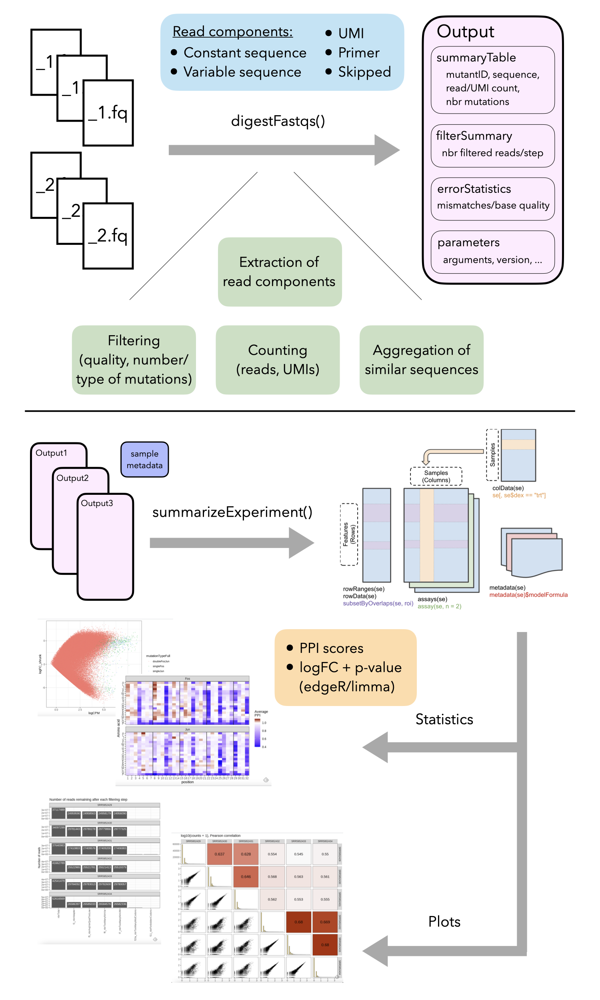

```{r, include = FALSE}
knitr::opts_chunk$set(
    collapse = TRUE,
    comment = "#>"
)
```

```{r setup, message = FALSE}
library(SummarizedExperiment)
library(mutscan)
```

# Introduction

`mutscan` provides functionality for processing and visualizing Multiplexed 
Assays of Variant Effect (MAVE) and other similar types of data, starting from 
single-end or paired-end FASTQ files. 
A broad range of library designs can be processed, encompassing experiments 
considering either a single protein or combinations of multiple proteins (e.g., 
aimed at studying protein-protein interactions).

The figure below provides a high-level overview of the `mutscan` functionality,
which will be described in more detail in the following sections. 

```{r overview-figure, fig.align = 'center', out.width = "100%", fig.cap = "Overview of the `mutscan` functionality. The `digestFastqs()` function processes each sequencing library, possibly consisting of multiple (pairs of) FASTQ files, separately, and generates an output object containing, among other things, the count table and a summary of the filtering steps. The `summarizeExperiment()` function takes one or more of these objects and combines them into a `SummarizedExperiment` object, that can then be used for downstream analysis such as plotting and statistical testing.", echo = FALSE}

```


# Example data

The `mutscan` package contains several small example FASTQ files 
representing different types of experiments:

```{r readTrans}
datadir <- system.file("extdata", package = "mutscan")
dir(datadir)
```

- `transInput_{1,2}.fastq.gz`, `transOutput_{1,2}.fastq.gz` - data from TRANS
experiment in [@Diss2018]. The forward and reverse reads correspond to the
mutated _FOS_ and _JUN_ sequences, respectively. Each read consists of a UMI
sequence, followed by a constant sequence and the variable region.
- `cisInput_{1,2}.fastq.gz`, `cisOutput_{1,2}.fastq.gz` - data from CIS
experiment in [@Diss2018]. The forward and reverse reads both correspond to the
mutated _FOS_ sequence. Each read consists of a UMI sequence, followed by a
constant sequence and the variable region.
- `GSE102901_cis_se.rds` - a `SummarizedExperiment` object obtained by
processing the full CIS data from [@Diss2018].
- `leujunt0_{1,2}.fastq.gz` - unpublished data; the forward read corresponds to
an unmutated sequence of one of 46 leucine zipper sequences, and the reverse
read corresponds to mutated _JUN_ sequences. Each read contains a
(frame-shifted) primer sequence, followed by the variable region.

# Processing Multiplexed Assays of Variant Effect data

## Read composition specification

The main function for processing the Multiplexed Assays of Variant Effect 
FASTQ files is `digestFastqs()`. This function requires the specification of 
paths to compressed FASTQ file(s) and the composition of the reads in these 
files. The composition is specified by the user, and is given in the form of 
a character string indicating the parts constituting the respective read, and 
an integer vector specifying the lengths of the individual parts. The 
permitted components are: 

* `S` (skip) - nucleotide(s) to skip
* `U` (UMI) - UMI sequence 
* `C` (constant) - constant sequence, can be used e.g. to estimate the 
sequencing error rate if available
* `V` (variable) - nucleotides corresponding to the variable region
* `P` (primer) - a primer sequence, which may appear in a nonspecified 
position in the read but whose position defines the start or end 
position of other components. 

A read can have several components of the same type (e.g., skipped nucleotides
both in the beginning or the end, or two variable regions separated by 
a primer). In such cases, `mutscan` will concatenate all components of the 
same type in the processing, while recording the lengths of the individual 
components.

As an example, a read with the following composition:

[1 skipped nt] - [10 nt UMI] - [18 nt constant sequence] - [96 nt variable region] 

would be specified to `digestFastqs()` by an elements string `"SUCV"`, 
and an element length vector `c(1, 10, 18, 96)`. 

The package can also accommodate designs with primer sequences. In this situation, 
the primer acts as an 'anchor', and the read composition before and after the 
primer is specified. For example, a read with the following composition:

[unknown sequence] - [10 nt primer] - [variable region, constituting the remainder of the read]

would be represented by an elements string `"SPV"`, and an element length 
vector `c(-1, 10, -1)`, where the -1 indicates that the corresponding read part
consists of the remaining part of the read, not accounted for by any of the other 
specified parts. In addition, the sequence of the primer must be specified, and 
any read where the primer is not present will be discarded. 

The forward and reverse reads can have different compositions. The user can 
also specify whether the variable parts of the forward and/or
reverse reads should be reverse complemented before being processed, and whether the
variable regions of the forward and reverse reads should be merged into a single
consensus sequence.

## Filtering 

In addition to reading the FASTQ files, the `digestFastqs()` function will perform
a series of filtering steps, in the following order:

* Search for perfect matches to forward/reverse adapter sequences, filter out
the read pair if a match is found in either the forward or reverse read.
* Search for perfect matches to forward/reverse primer sequences, filter out the
read pair if not both are found.
* Filter out reads whose length is not compatible with the indicated 
composition.
* If forward and reverse variable regions should be merged, filter out read
pairs where no valid overlap could be found.
* Filter out read pair if the average quality in the variable region is below
`avePhredMin` in either the forward or reverse read (or the consensus sequence
if they are merged).
* Filter out read pair if the number of Ns in the variable region exceeds
`variableNMax`.
* Filter out read pair if the number of Ns in the combined forward and reverse
UMI sequence exceeds `umiNMax`.
* If wild type (reference) sequences are provided (via `wildTypeForward` and/or 
`wildTypeReverse`), filter out reads if there are multiple best matches among 
the provided wild type sequences.
* Filter out read pair if any mutated base has a quality below
`mutatedPhredMin`.
* Filter out read pair if the number of mutated codons exceeds
`nbrMutatedCodonsMax` or the number of mutated nucleotides exceeds 
`nbrMutatedBasesMax`.
* Filter out read pair if any of the mutated codons match any of the
codons encoded by `forbiddenMutatedCodons`.
* Filter out read pair if there are too many mutations in the constant 
sequence, or if there are multiple equally close best hits among the 
provided constant sequences. 

Reads that are filtered out in one step will not be processed further (and 
thus will not contribute to the count of reads being filtered out for any 
other reasons). 

# Processing TRANS data

Here, we illustrate the processing of the provided TRANS experiment example
data. We filter out reads with any adapter match, an average phred quality below
20, any Ns in the UMI or variable sequence, more than one mutated codon, or a
mutated codon ending with A or T (represented by the `NNW` value of the
`forbiddenMutatedCodonsForward` and `forbiddenMutatedCodonsReverse` arguments). 
In order to identify the number of mutations, we have to provide the wild type 
sequences of _FOS_ and _JUN_ (forward and reverse reads, respectively). This 
will additionally name the final mutants according to the positions and 
sequences of the mutated codons. 

```{r}
transInput <- digestFastqs(
    fastqForward = file.path(datadir, "transInput_1.fastq.gz"),
    fastqReverse = file.path(datadir, "transInput_2.fastq.gz"),
    mergeForwardReverse = FALSE, 
    revComplForward = FALSE, 
    revComplReverse = FALSE,
    adapterForward = "GGAAGAGCACACGTC", 
    adapterReverse = "GGAAGAGCGTCGTGT", 
    elementsForward = "SUCV",
    elementsReverse = "SUCV",
    elementLengthsForward = c(1, 10, 18, 96),
    elementLengthsReverse = c(1, 8, 20, 96),
    constantForward = "AACCGGAGGAGGGAGCTG",
    constantReverse = "GAAAAAGGAAGCTGGAGAGA", 
    avePhredMinForward = 20, 
    avePhredMinReverse = 20,
    variableNMaxForward = 0, 
    variableNMaxReverse = 0, 
    umiNMax = 0,
    wildTypeForward = c(FOS = "ACTGATACACTCCAAGCGGAGACAGACCAACTAGAAGATGAGAAGTCTGCTTTGCAGACCGAGATTGCCAACCTGCTGAAGGAGAAGGAAAAACTA"), 
    wildTypeReverse = c(JUN = "ATCGCCCGGCTGGAGGAAAAAGTGAAAACCTTGAAAGCTCAGAACTCGGAGCTGGCGTCCACGGCCAACATGCTCAGGGAACAGGTGGCACAGCTT"), 
    nbrMutatedCodonsMaxForward = 1, 
    nbrMutatedCodonsMaxReverse = 1,
    forbiddenMutatedCodonsForward = "NNW", 
    forbiddenMutatedCodonsReverse = "NNW",
    mutNameDelimiter = ".", 
    constantMaxDistForward = -1,
    constantMaxDistReverse = -1,
    verbose = FALSE
)
```

The `digestFastqs()` function returns a list with four elements. The `parameters`
list records all parameter values used during the processing, as well as the
`mutscan` version and time of processing.

```{r}
transInput$parameters
```

The `filterSummary` data.frame contains a summary of the number of reads
filtered out in each step. Note that for any given filtering step, only the
reads retained by the previous filters are considered. The numbers in the filter
column names indicate the order of the filters.

```{r}
transInput$filterSummary
```

The `summaryTable` provides the number of reads and unique UMIs observed for
each variable sequence pair. The underscore in the strings in the sequence 
column indicate the separation between the forward and reverse wild type 
sequences. In addition, the table contains a column `mutantName`, which
provides a shorthand notation for each mutant. The format of the values in this
column is a combination of `WTS.xx.NNN` (separated by `_`), where `WTS` provides 
the name of the closest matching wild type sequence (if only one, unnamed wild 
type sequence is provided, the name will be `f/r` depending on if it corresponds
to the forward/reverse read, respectively). The `xx` part indicates the mutated 
codon or nucleotide number, and `NNN` gives the observed sequence for the mutated 
codon or nucleotide. A sequence without mutations is named `WTS.0.WT`, where, 
again, `WTS` is the name of the matching wild type sequence.

```{r}
head(transInput$summaryTable)
```

Finally, the `errorStatistics` data.frame lists the number of matching and
mismatching bases in the constant sequences, stratified by the phred quality
score (from 0 to 99).

```{r}
transInput$errorStatistics[rowSums(transInput$errorStatistics[, -1]) != 0, ]
```

The `errorStatistics` output can be used to estimate the sequencing error rate:

```{r errStats}
(propErrorsConstantF <- sum(transInput$errorStatistics$nbrMismatchForward) /
   (nchar(transInput$parameters$constantForward) * transInput$filterSummary$nbrRetained))
(propErrorsConstantR <- sum(transInput$errorStatistics$nbrMismatchReverse) /
   (nchar(transInput$parameters$constantReverse) * transInput$filterSummary$nbrRetained))
```

# Processing CIS data

Next, we illustrate the processing of the provided CIS experiment example data.
Recall that in this case, both the forward and reverse variable sequence 
correspond to the same mutated _FOS_ sequence, and before matching to the 
wild type sequence, the two components need to be merged to generate a single 
variable sequence (this is specified via the `mergeForwardReverse` argument).
As for the TRANS data, we filter out reads with any adapter match, an average
phred quality below 20, any Ns in the UMI or variable sequence, more than one
mutated codon, or a mutated codon ending with A or T (represented by the `NNW`
value of the `forbiddenMutatedCodonsForward` argument). Since the 
forward and reverse variable sequences are merged into one variable 
sequence, only one wild type sequence is provided (the `wildTypeReverse`
argument will be ignored if specified).

```{r}
cisInput <- digestFastqs(
    fastqForward = file.path(datadir, "cisInput_1.fastq.gz"),
    fastqReverse = file.path(datadir, "cisInput_2.fastq.gz"),
    mergeForwardReverse = TRUE, 
    minOverlap = 0, 
    maxOverlap = 0, 
    maxFracMismatchOverlap = 1, 
    greedyOverlap = TRUE, 
    revComplForward = FALSE, 
    revComplReverse = TRUE,
    adapterForward = "GGAAGAGCACACGTC", 
    adapterReverse = "GGAAGAGCGTCGTGT", 
    elementsForward = "SUCV", 
    elementsReverse = "SUCVS",
    elementLengthsForward = c(1, 10, 18, 96),
    elementLengthsReverse = c(1, 7, 17, 96, -1),
    constantForward = "AACCGGAGGAGGGAGCTG",
    constantReverse = "GAGTTCATCCTGGCAGC", 
    primerForward = "", 
    primerReverse = "",
    avePhredMinForward = 20, 
    avePhredMinReverse = 20,
    variableNMaxForward = 0, 
    variableNMaxReverse = 0, 
    umiNMax = 0,
    wildTypeForward = c(FOS = "ACTGATACACTCCAAGCGGAGACAGACCAACTAGAAGATGAGAAGTCTGCTTTGCAGACCGAGATTGCCAACCTGCTGAAGGAGAAGGAAAAACTA"), 
    wildTypeReverse = "", 
    nbrMutatedCodonsMaxForward = 1, 
    nbrMutatedCodonsMaxReverse = 1, 
    forbiddenMutatedCodonsForward = "NNW", 
    forbiddenMutatedCodonsReverse = "NNW",
    mutNameDelimiter = ".", 
    constantMaxDistForward = -1,
    constantMaxDistReverse = -1,
    verbose = TRUE
)
```

```{r}
cisInput$parameters
cisInput$filterSummary
cisInput$errorStatistics[rowSums(cisInput$errorStatistics[, -1]) != 0, ]
```

The `summaryTable` now provides the number of reads and unique UMIs observed for
each variable sequence, and all values in the `mutNames` column will start
with `FOS`.

```{r}
head(cisInput$summaryTable)
```

# Processing TRANS data with primers

Finally, we illustrate the processing of the provided example data, where the 
first read corresponds to one of 46 leucine zipper sequences, and the second 
read is a mutated _JUN_ sequence. We first need to define the possible 
sequences for the forward read. If multiple wild type sequences are provided 
like here, `mutscan` will match each read against all of them and find the 
most similar one for each read.

```{r}
leu <- c(
    ATF2 = "GATCCTGATGAAAAAAGGAGAAAGTTTTTAGAGCGAAATAGAGCAGCAGCTTCAAGATGCCGACAAAAAAGGAAAGTCTGGGTTCAGTCTTTAGAGAAGAAAGCTGAAGACTTGAGTTCATTAAATGGTCAGCTGCAGAGTGAAGTCACCCTGCTGAGAAATGAAGTGGCACAGCTGAAACAGCTTCTTCTGGCT",
    ATF7 = "GATCCAGATGAGCGACGGCAGCGCTTTCTGGAGCGCAACCGGGCTGCAGCCTCCCGCTGCCGCCAAAAGCGAAAGCTGTGGGTGTCCTCCCTAGAGAAGAAGGCCGAAGAACTCACTTCTCAGAACATTCAGCTGAGTAATGAAGTCACATTACTACGCAATGAGGTGGCCCAGTTGAAACAGCTACTGTTAGCT",
    CREB5 = "GATCCGGACGAGAGGCGGCGGAAATTTCTGGAACGGAACCGGGCAGCTGCCACCCGCTGCAGACAGAAGAGGAAGGTCTGGGTGATGTCATTGGAAAAGAAAGCAGAAGAACTCACCCAGACAAACATGCAGCTTCAGAATGAAGTGTCTATGTTGAAAAATGAGGTGGCCCAGCTGAAACAGTTGTTGTTAACA",
    ATF3 = "GAAGAAGATGAAAGGAAAAAGAGGCGACGAGAAAGAAATAAGATTGCAGCTGCAAAGTGCCGAAACAAGAAGAAGGAGAAGACGGAGTGCCTGCAGAAAGAGTCGGAGAAGCTGGAAAGTGTGAATGCTGAACTGAAGGCTCAGATTGAGGAGCTCAAGAACGAGAAGCAGCATTTGATATACATGCTCAACCTT",
    JDP2 = "GAGGAAGAGGAGCGAAGGAAAAGGCGCCGGGAGAAGAACAAAGTCGCAGCAGCCCGATGCCGGAACAAGAAGAAGGAGCGCACGGAGTTTCTGCAGCGGGAATCCGAGCGGCTGGAACTCATGAACGCAGAGCTGAAGACCCAGATTGAGGAGCTGAAGCAGGAGCGGCAGCAGCTCATCCTGATGCTGAACCGA",
    ATF4 = "GAGAAACTGGATAAGAAGCTGAAAAAAATGGAGCAAAACAAGACAGCAGCCACTAGGTACCGCCAGAAGAAGAGGGCGGAGCAGGAGGCTCTTACTGGTGAGTGCAAAGAGCTGGAAAAGAAGAACGAGGCTCTAAAAGAGAGGGCGGATTCCCTGGCCAAGGAGATCCAGTACCTGAAAGATTTGATAGAAGAG",
    ATF5 = "ACCCGAGGGGACCGCAAGCAAAAGAAGAGAGACCAGAACAAGTCGGCGGCTCTGAGGTACCGCCAGCGGAAGCGGGCAGAGGGTGAGGCCCTGGAGGGCGAGTGCCAGGGGCTGGAGGCACGGAATCGCGAGCTGAAGGAACGGGCAGAGTCCGTGGAGCGCGAGATCCAGTACGTCAAGGACCTGCTCATCGAG",
    CREBZF = "AGTCCCCGGAAGGCGGCGGCGGCCGCTGCCCGCCTTAATCGACTGAAGAAGAAGGAGTACGTGATGGGGCTGGAGAGTCGAGTCCGGGGTCTGGCAGCCGAGAACCAGGAGCTGCGGGCCGAGAATCGGGAGCTGGGCAAACGCGTACAGGCACTGCAGGAGGAGAGTCGCTACCTACGGGCAGTCTTAGCCAAC",
    BATF2 = "CCCAAGGAGCAACAAAGGCAGCTGAAGAAGCAGAAGAACCGGGCAGCCGCCCAGCGAAGCCGGCAGAAGCACACAGACAAGGCAGACGCCCTGCACCAGCAGCACGAGTCTCTGGAAAAAGACAACCTCGCCCTGCGGAAGGAGATCCAGTCCCTGCAGGCCGAGCTGGCGTGGTGGAGCCGGACCCTGCACGTG",
    BATF3 = "GAGGATGATGACAGGAAGGTCCGAAGGAGAGAAAAAAACCGAGTTGCTGCTCAGAGAAGTCGGAAGAAGCAGACCCAGAAGGCTGACAAGCTCCATGAGGAATATGAGAGCCTGGAGCAAGAAAACACCATGCTGCGGAGAGAGATCGGGAAGCTGACAGAGGAGCTGAAGCACCTGACAGAGGCACTGAAGGAG",
    CEBPE = "AAAGATAGCCTTGAGTACCGGCTGAGGCGGGAGCGCAACAACATCGCCGTGCGCAAGAGCCGAGACAAGGCCAAGAGGCGCATTCTGGAGACGCAGCAGAAGGTGCTGGAGTACATGGCAGAGAACGAGCGCCTCCGCAGCCGCGTGGAGCAGCTCACCCAGGAGCTAGACACCCTCCGCAACCTCTTCCGCCAG",
    BACH1 = "CTGGATTGTATCCATGATATTCGAAGAAGAAGTAAAAACAGAATTGCTGCACAGCGCTGTCGCAAGAGAAAACTTGACTGTATACAGAATCTTGAATCAGAAATTGAGAAGCTGCAAAGTGAAAAGGAGAGCTTGTTGAAGGAAAGAGATCACATTTTGTCAACTCTGGGTGAGACAAAGCAGAACCTAACTGGA",
    BACH2 = "TTAGAGTTTATTCATGATGTCCGACGGCGCAGCAAGAACCGCATCGCGGCCCAGCGCTGCCGCAAAAGGAAACTGGACTGTATTCAGAATTTAGAATGTGAAATCCGCAAATTGGTGTGTGAGAAAGAGAAACTGTTGTCAGAGAGGAATCAACTGAAAGCATGCATGGGGGAACTGTTGGACAACTTCTCCTGC",
    NFE2L1 = "CTGAGCCTCATCCGAGACATCCGGCGCCGGGGCAAGAACAAGATGGCGGCGCAGAACTGCCGCAAGCGCAAGCTGGACACCATCCTGAATCTGGAGCGTGATGTGGAGGACCTGCAGCGTGACAAAGCCCGGCTGCTGCGGGAGAAAGTGGAGTTCCTGCGCTCCCTGCGACAGATGAAGCAGAAGGTCCAGAGC",
    NFE2 = "CTAGCGCTAGTCCGGGACATCCGACGACGGGGCAAAAACAAGGTGGCAGCCCAGAACTGCCGCAAGAGGAAGCTGGAAACCATTGTGCAGCTGGAGCGGGAGCTGGAGCGGCTGACCAATGAACGGGAGCGGCTTCTCAGGGCCCGCGGGGAGGCAGACCGGACCCTGGAGGTCATGCGCCAACAGCTGACAGAG",
    NFIL3 = "AAGAAAGATGCTATGTATTGGGAAAAAAGGCGGAAAAATAATGAAGCTGCCAAAAGATCTCGTGAGAAGCGTCGACTGAATGACCTGGTTTTAGAGAACAAACTAATTGCACTGGGAGAAGAAAACGCCACTTTAAAAGCTGAGCTGCTTTCACTAAAATTAAAGTTTGGTTTAATTAGCTCCACAGCATATGCT",
    FOS = "GAAGAAGAAGAGAAAAGGAGAATCCGAAGGGAAAGGAATAAGATGGCTGCAGCCAAATGCCGCAACCGGAGGAGGGAGCTGACTGATACACTCCAAGCGGAGACAGACCAACTAGAAGATGAGAAGTCTGCTTTGCAGACCGAGATTGCCAACCTGCTGAAGGAGAAGGAAAAACTAGAGTTCATCCTGGCAGCT",
    FOSB = "GAGGAAGAGGAGAAGCGAAGGGTGCGCCGGGAACGAAATAAACTAGCAGCAGCTAAATGCAGGAACCGGCGGAGGGAGCTGACCGACCGACTCCAGGCGGAGACAGATCAGTTGGAGGAAGAAAAAGCAGAGCTGGAGTCGGAGATCGCCGAGCTCCAAAAGGAGAAGGAACGTCTGGAGTTTGTGCTGGTGGCC",
    FOSL1 = "GAGGAAGAGGAGCGCCGCCGAGTAAGGCGCGAGCGGAACAAGCTGGCTGCGGCCAAGTGCAGGAACCGGAGGAAGGAACTGACCGACTTCCTGCAGGCGGAGACTGACAAACTGGAAGATGAGAAATCTGGGCTGCAGCGAGAGATTGAGGAGCTGCAGAAGCAGAAGGAGCGCCTAGAGCTGGTGCTGGAAGCC",
    FOSL2 = "GAAGAGGAGGAGAAGCGTCGCATCCGGCGGGAGAGGAACAAGCTGGCTGCAGCCAAGTGCCGGAACCGACGCCGGGAGCTGACAGAGAAGCTGCAGGCGGAGACAGAGGAGCTGGAGGAGGAGAAGTCAGGCCTGCAGAAGGAGATTGCTGAGCTGCAGAAGGAGAAGGAGAAGCTGGAGTTCATGTTGGTGGCT",
    MAFB = "GTGATCCGCCTGAAGCAGAAGCGGCGGACCCTGAAGAACCGGGGCTACGCCCAGTCTTGCAGGTATAAACGCGTCCAGCAGAAGCACCACCTGGAGAATGAGAAGACGCAGCTCATTCAGCAGGTGGAGCAGCTTAAGCAGGAGGTGTCCCGGCTGGCCCGCGAGAGAGACGCCTACAAGGTCAAGTGCGAGAAA",
    JUN = "CAGGAGCGGATCAAGGCGGAGAGGAAGCGCATGAGGAACCGCATCGCTGCCTCCAAGTGCCGAAAAAGGAAGCTGGAGAGAATCGCCCGGCTGGAGGAAAAAGTGAAAACCTTGAAAGCTCAGAACTCGGAGCTGGCGTCCACGGCCAACATGCTCAGGGAACAGGTGGCACAGCTTAAACAGAAAGTCATGAAC",
    JUNB = "CAAGAGCGCATCAAAGTGGAGCGCAAGCGGCTGCGGAACCGGCTGGCGGCCACCAAGTGCCGGAAGCGGAAGCTGGAGCGCATCGCGCGCCTGGAGGACAAGGTGAAGACGCTCAAGGCCGAGAACGCGGGGCTGTCGAGTACCGCCGGCCTCCTCCGGGAGCAGGTGGCCCAGCTCAAACAGAAGGTCATGACC",
    JUND = "CAGGAGCGCATCAAGGCGGAGCGCAAGCGGCTGCGCAACCGCATCGCCGCCTCCAAGTGCCGCAAGCGCAAGCTGGAGCGCATCTCGCGCCTGGAAGAGAAAGTGAAGACCCTCAAGAGTCAGAACACGGAGCTGGCGTCCACGGCGAGCCTGCTGCGCGAGCAGGTGGCGCAGCTCAAGCAGAAAGTCCTCAGC",
    CREB3 = "GAACAAATTCTGAAACGTGTGCGGAGGAAGATTCGAAATAAAAGATCTGCTCAAGAGAGCCGCAGGAAAAAGAAGGTGTATGTTGGGGGTTTAGAGAGCAGGGTCTTGAAATACACAGCCCAGAATATGGAGCTTCAGAACAAAGTACAGCTTCTGGAGGAACAGAATTTGTCCCTTCTAGATCAACTGAGGAAA",
    HLF = "CTGAAGGATGACAAGTACTGGGCAAGGCGCAGAAAGAACAACATGGCAGCCAAGCGCTCCCGCGACGCCCGGAGGCTGAAAGAGAACCAGATCGCCATCCGGGCCTCGTTCCTGGAGAAGGAGAACTCGGCCCTCCGCCAGGAGGTGGCTGACTTGAGGAAGGAGCTGGGCAAATGCAAGAACATACTTGCCAAG",
    MAFG = "ATCGTCCAGCTGAAGCAGCGCCGGCGCACGCTCAAGAACCGCGGCTACGCTGCCAGCTGCCGCGTGAAGCGGGTGACGCAGAAGGAGGAGCTGGAGAAGCAGAAGGCGGAGCTGCAGCAGGAGGTGGAGAAGCTGGCCTCAGAGAACGCCAGCATGAAGCTGGAGCTCGACGCGCTGCGCTCCAAGTACGAGGCG",
    MAFK = "GTGACCCGCCTGAAGCAGCGTCGGCGCACACTCAAGAACCGCGGCTACGCGGCCAGCTGCCGCATCAAGCGGGTGACGCAGAAGGAGGAGCTGGAGCGGCAGCGCGTGGAGCTGCAGCAGGAGGTGGAGAAGCTGGCGCGTGAGAACAGCAGCATGCGGCTGGAGCTGGACGCCCTGCGCTCCAAGTACGAGGCG",
    XBP1 = "AGCCCCGAGGAGAAGGCGCTGAGGAGGAAACTGAAAAACAGAGTAGCAGCTCAGACTGCCAGAGATCGAAAGAAGGCTCGAATGAGTGAGCTGGAACAGCAAGTGGTAGATTTAGAAGAAGAGAACCAAAAACTTTTGCTAGAAAATCAGCTTTTACGAGAGAAAACTCATGGCCTTGTAGTTGAGAACCAGGAG",
    ATF6 = "ATTGCTGTGCTAAGGAGACAGCAACGTATGATAAAAAATCGAGAATCCGCTTGTCAGTCTCGCAAGAAGAAGAAAGAATATATGCTAGGGTTAGAGGCGAGATTAAAGGCTGCCCTCTCAGAAAACGAGCAACTGAAGAAAGAAAATGGAACACTGAAGCGGCAGCTGGATGAAGTTGTGTCAGAGAACCAGAGG",
    ATF6B = "GCAAAGCTGCTGAAGCGGCAGCAGCGAATGATCAAGAACCGGGAGTCAGCCTGCCAGTCCCGGAGAAAGAAGAAAGAGTATCTGCAGGGACTGGAGGCTCGGCTGCAAGCAGTACTGGCTGACAACCAGCAGCTCCGCCGAGAGAATGCTGCCCTCCGGCGGCGGCTGGAGGCCCTGCTGGCTGAAAACAGCGAG",
    CEBPA = "AAGAACAGCAACGAGTACCGGGTGCGGCGCGAGCGCAACAACATCGCGGTGCGCAAGAGCCGCGACAAGGCCAAGCAGCGCAACGTGGAGACGCAGCAGAAGGTGCTGGAGCTGACCAGTGACAATGACCGCCTGCGCAAGCGGGTGGAACAGCTGAGCCGCGAACTGGACACGCTGCGGGGCATCTTCCGCCAG",
    CEBPB = "AAGCACAGCGACGAGTACAAGATCCGGCGCGAGCGCAACAACATCGCCGTGCGCAAGAGCCGCGACAAGGCCAAGATGCGCAACCTGGAGACGCAGCACAAGGTCCTGGAGCTCACGGCCGAGAACGAGCGGCTGCAGAAGAAGGTGGAGCAGCTGTCGCGCGAGCTCAGCACCCTGCGGAACTTGTTCAAGCAG",
    CEBPD = "CGCGGCAGCCCCGAGTACCGGCAGCGGCGCGAGCGCAACAACATCGCCGTGCGCAAGAGCCGCGACAAGGCCAAGCGGCGCAACCAGGAGATGCAGCAGAAGTTGGTGGAGCTGTCGGCTGAGAACGAGAAGCTGCACCAGCGCGTGGAGCAGCTCACGCGGGACCTGGCCGGCCTCCGGCAGTTCTTCAAGCAG",
    CEBPG = "CGAAACAGTGACGAGTATCGGCAACGCCGAGAGAGGAACAACATGGCTGTGAAAAAGAGCCGGTTGAAAAGCAAGCAGAAAGCACAAGACACACTGCAGAGAGTCAATCAGCTCAAAGAAGAGAATGAACGGTTGGAAGCAAAAATCAAATTGCTGACCAAGGAATTAAGTGTACTCAAAGATTTGTTTCTTGAG",
    CREB1 = "GAAGCAGCACGAAAGAGAGAGGTCCGTCTAATGAAGAACAGGGAAGCAGCTCGAGAGTGTCGTAGAAAGAAGAAAGAATATGTGAAATGTTTAGAAAACAGAGTGGCAGTGCTTGAAAATCAAAACAAGACATTGATTGAGGAGCTAAAAGCACTTAAGGACCTTTACTGCCACAAATCAGAT",
    CREB3L1 = "GAGAAGGCCTTGAAGAGAGTCCGGAGGAAAATCAAGAACAAGATCTCAGCCCAGGAGAGCCGTCGTAAGAAGAAGGAGTATGTGGAGTGTCTAGAAAAGAAGGTGGAGACATTTACATCTGAGAACAATGAACTGTGGAAGAAGGTGGAGACCCTGGAGAATGCCAACAGGACCCTGCTCCAGCAGCTGCAGAAA",
    CREB3L2 = "GAGAAGGCCCTGAAGAAAATTCGGAGGAAGATCAAGAATAAGATTTCTGCTCAGGAAAGTAGGAGAAAGAAGAAAGAATACATGGACAGCCTGGAGAAAAAAGTGGAGTCTTGTTCAACTGAGAACTTGGAGCTTCGGAAGAAGGTAGAGGTTCTAGAGAACACTAATAGGACTCTCCTTCAGCAACTCCAGAAG",
    CREB3L3 = "GAGCGAGTGCTGAAAAAAATCCGCCGGAAAATCCGGAACAAGCAGTCGGCGCAAGAAAGCAGGAAGAAGAAGAAGGAATATATCGATGGCCTGGAGACTCGGATGTCAGCTTGCACTGCTCAGAATCAGGAGTTACAGAGGAAAGTCTTGCATCTCGAGAAGCAAAACCTGTCCCTCTTGGAGCAACTGAAGAAA",
    CREB3L4 = "GAGAGGGTCCTCAAGAAGGTCAGGAGGAAAATCCGTAACAAGCAGTCAGCTCAGGACAGTCGGCGGCGGAAGAAGGAGTACATTGATGGGCTGGAGAGCAGGGTGGCAGCCTGTTCTGCACAGAACCAAGAATTACAGAAAAAAGTCCAGGAGCTGGAGAGGCACAACATCTCCTTGGTAGCTCAGCTCCGCCAG",
    CREBL2 = "CCAGCCAAAATTGACTTGAAAGCAAAACTTGAGAGGAGCCGGCAGAGTGCAAGAGAATGCCGAGCCCGAAAAAAGCTGAGATATCAGTATTTGGAAGAGTTGGTATCCAGTCGAGAAAGAGCTATATGTGCCCTCAGAGAGGAACTGGAAATGTACAAGCAGTGGTGCATGGCAATGGACCAAGGAAAAATCCCT",
    CREBRF = "CCCTTAACAGCCCGACCAAGGTCAAGGAAGGAAAAAAATAAGCTGGCTTCCAGAGCTTGTCGGTTAAAGAAGAAAGCCCAGTATGAAGCTAATAAAGTGAAATTATGGGGCCTCAACACAGAATATGATAATTTATTGTTTGTAATCAACTCCATCAAGCAAGAGATTGTAAACCGGGTACAGAATCCAAGAGAT",
    DBP = "CAGAAGGATGAGAAATACTGGAGCCGGCGGTACAAGAACAACGAGGCAGCCAAGCGGTCCCGTGACGCCCGGCGGCTCAAGGAGAACCAGATATCGGTGCGGGCGGCCTTCCTGGAGAAGGAGAACGCCCTGCTGCGGCAGGAAGTTGTGGCCGTGCGCCAGGAGCTGTCCCACTACCGCGCCGTGCTGTCCCGA",
    NFE2L2 = "CTTGCATTAATTCGGGATATACGTAGGAGGGGTAAGAATAAAGTGGCTGCTCAGAATTGCAGAAAAAGAAAACTGGAAAATATAGTAGAACTAGAGCAAGATTTAGATCATTTGAAAGATGAAAAAGAAAAATTGCTCAAAGAAAAAGGAGAAAATGACAAAAGCCTTCACCTACTGAAAAAACAACTCAGCACC",
    NFE2L3 = "GTCTCACTTATCCGTGACATCAGACGAAGAGGGAAAAATAAAGTTGCTGCGCAGAACTGTCGTAAACGCAAATTGGACATAATTTTGAATTTAGAAGATGATGTATGTAACTTGCAAGCAAAGAAGGAAACTCTTAAGAGAGAGCAAGCACAATGTAACAAAGCTATTAACATAATGAAACAGAAACTGCATGAC",
    TEF = "CAGAAGGATGAAAAGTACTGGACAAGACGCAAGAAGAACAACGTGGCAGCTAAACGGTCACGGGATGCCCGGCGCCTGAAAGAGAATCAGATCACCATCCGGGCAGCCTTCCTGGAGAAGGAGAACACAGCCCTGCGGACGGAGGTGGCCGAGCTACGCAAGGAGGTGGGCAAGTGCAAGACCATCGTGTCCAAG"
)
```

Next we process the data, not allowing any mismatches in the forward read, but 1
mismatching codon in the reverse read. Now, we assume that the variable sequence
starts immediately after the provided primers, and hence we don't specify any
UMI/constant sequence lengths. For the forward read, the variable region is
taken to be the remainder of the read (after the primer), whereas for the
reverse read, we specify the variable sequence length to 96.

```{r}
leujunt0 <- digestFastqs(
    fastqForward = file.path(datadir, "leujunt0_1.fastq.gz"),
    fastqReverse = file.path(datadir, "leujunt0_2.fastq.gz"),
    mergeForwardReverse = FALSE, 
    revComplForward = FALSE, 
    revComplReverse = FALSE,
    elementsForward = "SPV", 
    elementsReverse = "SPVS",
    elementLengthsForward = c(-1, 19, -1),
    elementLengthsReverse = c(-1, 20, 96, -1),
    constantForward = "", 
    constantReverse = "", 
    adapterForward = "",
    adapterReverse = "", 
    primerForward = "GTCAGGTGGAGGCGGATCC", 
    primerReverse = "GAAAAAGGAAGCTGGAGAGA",
    avePhredMinForward = 20, 
    avePhredMinReverse = 20, 
    variableNMaxForward = 0, 
    variableNMaxReverse = 0, 
    umiNMax = 0,
    wildTypeForward = leu, 
    wildTypeReverse = c(JUN = "ATCGCCCGGCTGGAGGAAAAAGTGAAAACCTTGAAAGCTCAGAACTCGGAGCTGGCGTCCACGGCCAACATGCTCAGGGAACAGGTGGCACAGCTT"), 
    nbrMutatedCodonsMaxForward = 0, 
    nbrMutatedCodonsMaxReverse = 1, 
    forbiddenMutatedCodonsForward = "",
    forbiddenMutatedCodonsReverse = "NNW",
    mutatedPhredMinForward = 0.0, 
    mutatedPhredMinReverse = 0.0,
    mutNameDelimiter = ".", 
    verbose = TRUE
)
```

```{r}
leujunt0$parameters
leujunt0$filterSummary
```

```{r}
head(leujunt0$summaryTable)
```

# Combining samples

The `digestFastqs()` function processes each sample (pair of FASTQ files)
separately. In order to prepare the data for downstream statistical analysis
and plotting, the `summarizeExperiment()` function takes a named list 
of outputs from `digestFastqs()`, and a `data.frame` with sample annotations, 
and generates a `SummarizedExperiment` object, 
with an `assay` containing either UMI or read counts. To illustrate this, we 
process also the output sample for the TRANS experiment for which we 
processed the input sample above, and feed both outputs to 
`summarizeExperiment()`.

```{r combine}
transOutput <- digestFastqs(
    fastqForward = file.path(datadir, "transOutput_1.fastq.gz"),
    fastqReverse = file.path(datadir, "transOutput_2.fastq.gz"),
    mergeForwardReverse = FALSE, 
    revComplForward = FALSE, 
    revComplReverse = FALSE,
    adapterForward = "GGAAGAGCACACGTC", 
    adapterReverse = "GGAAGAGCGTCGTGT", 
    elementsForward = "SUCV", 
    elementsReverse = "SUCV",
    elementLengthsForward = c(1, 10, 18, 96),
    elementLengthsReverse = c(1, 8, 20, 96),
    constantForward = "AACCGGAGGAGGGAGCTG",
    constantReverse = "GAAAAAGGAAGCTGGAGAGA", 
    primerForward = "", 
    primerReverse = "",
    avePhredMinForward = 20, 
    avePhredMinReverse = 20,
    variableNMaxForward = 0, 
    variableNMaxReverse = 0, 
    umiNMax = 0,
    wildTypeForward = c(FOS = "ACTGATACACTCCAAGCGGAGACAGACCAACTAGAAGATGAGAAGTCTGCTTTGCAGACCGAGATTGCCAACCTGCTGAAGGAGAAGGAAAAACTA"), 
    wildTypeReverse = c(JUN = "ATCGCCCGGCTGGAGGAAAAAGTGAAAACCTTGAAAGCTCAGAACTCGGAGCTGGCGTCCACGGCCAACATGCTCAGGGAACAGGTGGCACAGCTT"), 
    nbrMutatedCodonsMaxForward = 1, 
    nbrMutatedCodonsMaxReverse = 1, 
    forbiddenMutatedCodonsForward = "NNW", 
    forbiddenMutatedCodonsReverse = "NNW",
    mutNameDelimiter = ".", 
    constantMaxDistForward = -1,
    constantMaxDistReverse = -1,
    verbose = FALSE
)

## Generate SummarizedExperiment object
se <- summarizeExperiment(
    x = list(sample1 = transInput,
             sample2 = transOutput),
    coldata = data.frame(Name = c("sample1", "sample2"),
                         Condition = c("input", "output"),
                         Replicate = c("R1", "R1"),
                         OD = c(0.05, 1.5))
)

## The SummarizedExperiment contains a count matrix, and annotations 
## for samples and variants in the `colData` and `rowData`, 
## respectively.
head(assay(se, "counts"))
Matrix::colSums(assay(se, "counts"))
head(rowData(se))
colData(se)

## Count type (reads or UMIs)
metadata(se)$countType
```

# Collapsing count matrix to amino acids

The \link{\code[SummarizedExperiment]{SummarizedExperiment}} object generated by
`summarizeExperiment()` contains one row for each observed variant
(combination). This can be further collapsed by replacing the mutated codon by
the corresponding amino acid, and aggregating the counts corresponding to the
same mutated amino acid (combination).

```{r}
se_collapsed <- collapseMutantsByAA(se)
head(assay(se_collapsed, "counts"))
Matrix::colSums(assay(se_collapsed, "counts"))
colData(se_collapsed)
```

# Diagnostic plots

`mutscan` contains functionality for 
generating a variety of diagnostic plots. Here we illustrate these using the 
full CIS data set from [@Diss2018], which has been processed using 
`digestFastqs()` as illustrated above, and summarized in a 
`SummarizedExperiment` object provided with the package. 

```{r}
se <- readRDS(file.path(datadir, "GSE102901_cis_se.rds"))
```

First, we can plot a summary of the filtering 
process, indicating the number of reads that were filtered out by 
(or retained after) each step of the `mutscan` filtering. 

```{r, fig.height=10, fig.width=8}
plotFiltering(se, valueType = "reads", onlyActiveFilters = TRUE, 
              plotType = "remaining", facetBy = "sample", numberSize = 3)
```

```{r, fig.height=10, fig.width=8}
plotFiltering(se, valueType = "fractions", onlyActiveFilters = TRUE,
              plotType = "filtered", facetBy = "step", numberSize = 3)
```

We can also generate a pairs plot displaying the correlation among the samples 
in the data set. 

```{r, fig.height=7}
plotPairs(se, selAssay = "counts")
```

Additional plot functions can be used to visualize the total count per sample, 
across all variants, or the distribution of variant counts per sample. 

```{r}
plotTotals(se, selAssay = "counts")
plotDistributions(se, selAssay = "counts", plotType = "density", 
                  pseudocount = 1)
```

Finally, we can create a full QC report as follows:

```{r, eval=FALSE}
generateQCReport(se, outFile = tempfile(fileext = ".html"))
```


# Calculating PPI scores

The function `calculatePPIScore()` can be used to calculate PPI scores as 
described in [@Diss2018]. The function requires the user to specify a `pairingCol`,
containing the replicate ID for each sample; one or more `ODCols`, containing
the optical density for each sample, and a `comparison`, which is a character
vector of length 3 specifying the comparison to perform, of the form
(`groupColumn`, `numerator`, `denominator`). Here, `groupColumn` is the name of
the column in `colData(se)` that contains the grouping information, and
`numerator` and `denominator` specify the values of this column representing the
two groups to be compared.

Here, we illustrate the application of `calculatePPIScore()` on the
SummarizedExperiment object containing all the three CIS
replicates from [@Diss2018].

```{r}
se_collapsed <- collapseMutantsByAA(se)
ppis <- calculatePPIScore(se = se_collapsed, pairingCol = "Replicate", 
                          ODCols = c("OD1", "OD2"),
                          comparison = c("Condition", "cis_output", "cis_input"),
                          WTrows = "f.0.WT")
head(ppis[order(abs(rowMeans(ppis)), decreasing = TRUE), , drop = FALSE])

## The PPI score for the WT sequence is 1, by construction
ppis["f.0.WT", , drop = FALSE]
```

# Scoring mutations with `edgeR` or `limma`

As an alternative to the PPI scoring, `mutscan` can be used to model the observed
counts using a generalized linear model (with `edgeR`) or a general linear model
(with `limma`) and estimate a logFC and a p-value for the enrichment of each
variant betwen two conditions (or more generally, in association with any
predictor), compared to one or more WT sequences. Note that for this, at least
two replicates are required.

We start by looking at the design matrix, in order to determine which of the 
coefficients to specify for the testing in `calculateRelativeFC()`. For more 
information about how to set up and interpret design matrices in `edgeR` or 
`limma`, see e.g. [Law et al (2020)](https://f1000research.com/articles/9-1444), 
or [Soneson et al (2020)](https://f1000research.com/articles/9-512).

```{r}
model.matrix(~ Replicate + Condition,
             data = colData(se_collapsed))
```

Next, we apply either `edgeR` or `limma` to extract the logFCs of the mutants, 
compared to the wildtype sequence.

```{r}
## edgeR
edger_scores <- calculateRelativeFC(
    se = se_collapsed,
    design = model.matrix(~ Replicate + Condition,
                          data = colData(se_collapsed)),
    coef = "Conditioncis_output", pseudocount = 1, WTrows = "f.0.WT",
    method = "edgeR")
head(edger_scores[order(edger_scores$PValue), , drop = FALSE])
## As before, the WT sequence has a logFC close to 0, by construction
edger_scores["f.0.WT", , drop = FALSE]

## limma
limma_scores <- calculateRelativeFC(
    se = se_collapsed,
    design = model.matrix(~ Replicate + Condition,
                          data = colData(se_collapsed)),
    coef = "Conditioncis_output", pseudocount = 1, WTrows = "f.0.WT",
    method = "limma")
head(limma_scores[order(limma_scores$P.Value), , drop = FALSE])
## As before, the WT sequence has a logFC close to 0, by construction
limma_scores["f.0.WT", , drop = FALSE]
```

`mutscan` also contains functions for plotting the results of the statistical 
testing - in particular, MA (mean-difference) plots and volcano plots can be 
easily generated. 

```{r}
plotMeanDiff(edger_scores, pointSize = "large")
plotVolcano(edger_scores, pointSize = "large")
```

# FAQ

### Can `digestFastqs` process a sample where the reads are spread across multiple (pairs of) FASTQ files?

Yes, you can specify a vector of FASTQ files to `fastqForward`/`fastqReverse`. 
In this case, the reads from all (pairs of) files will be analyzed as if they 
came from a single FASTQ file. In case of paired-end data, take care to specify 
the forward and reverse FASTQ files in the same order. 

# Session info

This vignette was compiled on the following system:

```{r}
sessionInfo()
```

